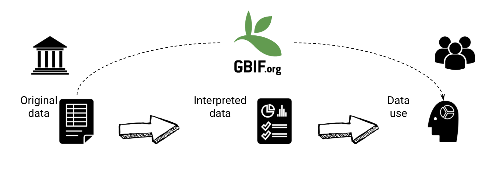
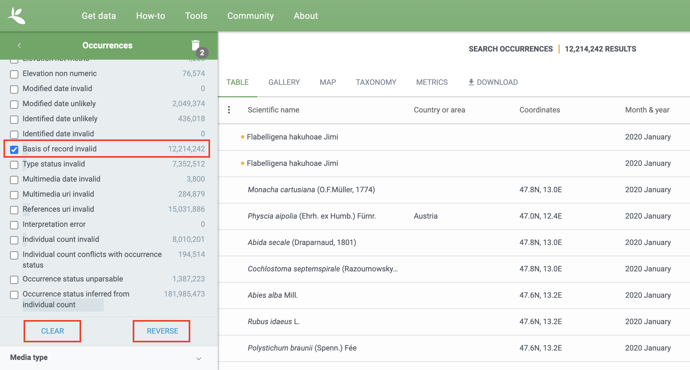

[multipage-level=2]
= Data Processing
[NOTE.objectives]
In the data processing module, you will familiarize yourself with the concept of fit-for purpose datasets and some commonly used data filters that you may want to consider for creating your own fit-for-purpose dataset. 

== Fit-for-purpose data
Correctness and Consistency are two ways of documenting data errors and are measures of data quality. 
These are measures of how well the data gatherer was able to capture the true value being investigated. 
The nature of GBIF's data publication workflow means that the correctness and consistency of the data can vary dependent on the data publishers and the source of the data.
Knowing these properties of the data you have, will help you to understand the ways in which you can and cannot clean, validate and process the data.

* Correctness (Accuracy) - closeness of measured values, observations or estimates to the real or true value e.g. has the species been identified correctly or the collection locality been identified correctly.

image::img/web/Correctness.png[align=center,width=640,height=360]

In the diagram it’s how close is the shot to the centre of the target.

* Consistency (Precision) - level of resolution of the data e.g. precision of coordinates, taxonomic determination.

image::img/web/Consistency.png[align=center,width=640,height=360]

In the diagram it is how close the shots are together irrespective of how near they are to the centre of the target.

For most analyses you want highly accurate data although the level of precision may vary dependent on your analysis.
GBIF can help you to determine the accuracy and precision of the data through, for example, filters and issue flags, however, you must always double-check!

=== Data Processing Tools
As outlined in 'Software Tools'you should use tools appropriate for you for processing your data post donwload. 
While GBIF filters will allow for some data processing, it is highly recommended that you additional data processing including a data visualisation step. 
Tools that can be used for this are: 

* Spreadsheet editing software e.g. Excel, Google Sheets (smaller datasets)
* OpenRefine
* R packages and scripts eg CoordinateCleaner, scrubr and biogeo (automated data processing)
* Geographical Information Systems (GIS) 

===Flags and Issues
The GBIF network publishes datasets, integrating them into a common access system. 
Here users can retrieve data through common search and download services. 
During the indexation process over the raw data, GBIF adds issues and flags to records with common data quality problems. 
These may contain useful information for you as a user to create fit-for-purpose datasets.  

Remarks are shown on the individual occurrence pages to explain the process done after interpretation:

*Excluded means the original data couldn’t be interpreted, so is excluded in the interpreted fields.
*Altered means the original data is modified in the interpretation process to be indexed in GBIF.org.
*Inferred means the Using other record information the data indexed is inferred, if the original is empty.

Excluding all records with a particular issue is not currently possible with the search interface. 
It is possible to filter all records you are not interested in with issues by selecting the particular issue and hitting the reverse button. 
However, reversing will still only give you all other flagged occurrences and not issue-free records. 
This is something that GBIF is working to improve. (at occurrence search)

A full overview of all issues and flags can be here: https://data-blog.gbif.org/post/issues-and-flags/

== Handling Taxonomic Uncertainty

Uncertainty surrounding the taxonomy of a data point can arise for several reasons:

* Species misidentification
* Synoynmy
* Novel names

=== Species misidentification

Species identification is a complex process, with species described from a certain set of characters identified in a published species description and linked to a type specimen held within a scientific collection that be used for validation of species identification. Where taxa are very similar or a set of complex traits are required for correct identification, specific taxonomic expertise may be required that data publishers may not possess leading to misidentification of species. As users, you must have a clear understanding of how taxonomic determinations for your interest group are made:

* what are the characters used for defining the species? Are these characters easily confused or captured when the species is observed or collected?
* Are there related species that could be easily confused with the species you are interested in? 

If you think that there is a risk that species may be incorrectly identified, you can take a conservative approach to the data you use and only use those data linked to specimens in collections where taxonomic validation would be possible and eliminate other data sources. Another approach may be to use associated data such as collector information, media, DNA sequences etc to validate the taxonomic determination.

=== Synonymy 

Synonymy can arise when the same species has been described several times and with each time a new name was given to the species, or when there is a change in the taxonomy of a species for example, a species is moved from one genus to another. Only one species name can be accepted, and other names are what we call synonyms. These synonyms may still be in use to a lesser or greater extent and you should be sure when getting data from GBIF to obtain data for the taxonomic name you need. GBIF's taxonomic backbone differentiates between accepted scientific names and synonyms, and unique identifiers in the form taxon keys. Species searches https://www.gbif.org/species/search allow for filtering for accepted names and synonyms and taxon keys can be used for programmatic searches of GBIF.

=== New names

There may be instances where the scientific name does not match any name in the GBIF backbone, perhaps because the species is newly described, or is not within a checklist used by GBIF to construct its backbone or it has been misspelled or badly formatted. These names are flagged with the TAXON_MATCH_HIGHERRANK flag indicating that the scientific name has not been recognised but that the data point has matched at a higher taxonomic level eg. genus or family. This flag can be used for identifying and filtering for these these data.

There is also a TAXON_MATCH_FUZZY flag that can be used for identifying and filtering names that can only match the taxonomic backbone using a fuzzy, non exact match.

Taxon Keys
If you are accessing GBIF-mediated data programatically as opposed to via the website, taxon keys provide an effective way for defining searches based on taxonomy. 
Scientific names can be messy. So it may make sense to sort out the species by their unique taxon keys provided during the indexation of the dataset by GIBF. 
Taxon keys are issued at the species, genus family, order, phylum and kingdom level. Unique identifiers are issued to accepted names with synonyms of those accepted names issued the same identifier.  
Takon keys allow for discerning between In the previous GBIF API and the version of rgbif that wrapped that API, you could search the equivalent of this function with a species name, which was convenient. 
However, names are messy right. So it sorta makes sense to sort out the species key numbers you want exactly, and then get your occurrence data with this function. 
GBIF has added a parameter scientificName to allow searches by scientific names in this function - which includes synonym taxa. 
Note: that if you do use the scientificName parameter, we will check internally that it's not a synonym of an accepted name, and if it is, we'll search on the accepted name. 
If you want to force searching by a synonym do so by finding the GBIF identifier first with any name_* functions, then pass that ID to the taxonKey parameter.

Almost always you will want to post-process your GBIF download in some way to fit your needs. 
Here I take you through some common data quality filters. 
Sometimes you will have to make difficult judgement calls for your particular use-case. 
Whenever you are dealing with thousands-millions of records, you will never quite know the true quality of the source data. 
It is important to keep in mind that you are always just mitigating data quality issues, not eliminating them. 

== Handling Data Quality

Filtering the data allows you as a user to obtain the data that is most fit for purpose. All searches have a set of filters that can be used for finding the data you need, and occurrence searches have a set of additional 'Advanced" search filters for users that need to do more advanced filtering.  While filters may allow you to filter out data that may not be relevant, or be of lower quality for your purposes, additonal filtering may be required either manually or programmaticially to deal with additional data quality issues that arise during the GBIF data publishing model.  Below are some common data filters that you as a user might consider to make the data more fit-for-purpose. 

=== Geospatial Filters & Issues

The data can be filtered spatially in an occurrrence search in one of 3 ways:

* Country or area/Continent - data is filtered by country and will include data within the Exclusive Economic Zone (EEZ)
* Administrative area - this filter uses the GADM database https://gadm.org/data.html of administrative areas for all countries in the world to allow for 
GBIF removes common geospatial issues by default if you choose to have data with a location.
* Location - this filter allows you to filter for data with coordinates and/or draw your own polygon shape filters or use a GeoJSON file to delimit your own shape filter. If you filter for those data with coordinates, a number of geospatial issues associated with the data publishing workflow will be eliminated. These are:

** Zero Coordinates- Coordinates are exactly (0,0) or what is sometimes called "null island". Zero-zero coordinate is a very common geospatial issue. GBIF removes (0,0) when hasgeospatialissue is set to FALSE.  
** Country coordinate mis-match - Data publishers will often supply GBIF with a country code (US,TW,SE,JP…). GBIF uses the two letter system. 
https://en.wikipedia.org/wiki/ISO_3166-1_alpha-2. When a point does not fall within the country’s polygon or EEZ, but says that it should occur within the country, it gets flagged as having “country coordinate mis-match” and will be removed if data are filtered for locations.
** Coordinate invalid - If GBIF is unable to interpret the coordinates i.e. the coordinates .
** Coordinate invalid - The coordinates are outside of the range for decimal lat/lon values ((-90,90), (-180,180)).

==== Country centroids

Country centroids are where the observation is pinned to center of the country instead of where the taxon was observed or recorded.
Country centroids are usually records that have been retrospectively given a lat-lon value based on a textual description of where the original record was located. Geocoding software uses gazetteers, geographical dictionaries or directories used in conjunction with a map or atlas, to attribute coordinates to place names. 
So, if the record simply says “Brazil”, some publishers will put the record in the center of Brazil. 
Similarly if the record simply says “Texas” or “Paris” the record will go in the center of those regions. 
This is almost exclusively a feature of museum data (PRESERVED_SPECIMEN), but it can also happen with other types of records as well.  

Identifying country centroid data is currently not possible using GBIF filters, however, the R package CoordinateCleaner can be used for identifying and filtering for country centroids.

==== Points along the equator or prime meridian

Some publishers consider zero and NULL to be equivalent so that empty latitude and longitude fields for a record are given a zero value.  As a result, records end up being plotted along these the equator and prime meridian lines.

==== Uncertain location 

Often you will want to be sure that the coordinates give a certain location and are not really 1000s of km away from where the organism was observed or collected. There are two fields coordinate precision and coordinateUncertaintyInMeters in Darwin Core that you get with a SIMPLE CSV download that you can use to filter by “uncertainty”.  However, these fields are not used very often by publishers who feel that their records are fairly certain (from a GPS) and we would not recommend not filtering out missing values. 

There are also a few “fake” values for coordinate uncertainty that you should be aware of. These values are errors produced by geocoding software and do not represent real uncertainty values. 
These "fake" values are 301, 3036, 999 and 9999.  
In the case of the value 301, the uncertainty is often much-much greater than 301 and actually represents a country centroid.

==== Absence records

By default, both presence and absence records are shown when you search www.gbif.org. 
Absence records confirm that a species was not found at a specific locality when that area was surveyed and this information can be useful in, for example, developing ecological niche models. 
However, you may only be interested in presence records and in this instance you can filter for only presence records using the Occurrence Status filter. 

==== Establishment Means

The Darwin Core term establishmentMeans identifies the process by which the biological individual(s) represented in the Occurrence became established at the location. 
As such, it can serve as a useful filtering tool for identifying records that are outside of a species native range with accepted terms for this field being native, nativeReintroduced, introduced, introducedAssistedColonisation, vagrant and uncertain.  
Currently, GBIF records can be searched using the older vocabulary terms native, introduced, naturalized, native, managed and uncertain -   https://rs.gbif.org/vocabulary/gbif/establishment_means.xml, and these will be updated in late 2022. 
In some instances,  removing “MANAGED” records will remove zoo records.

Use this filter cautiously, however, as most records do not contain this information and so would be exluded from a search with this filter on and we would recommend to use the information within the Establishement Means term for filtering after download. 

=== Basis of Record 

Basis of record is a Darwin Core term that refers to the specific nature of the record and can refer to one of 6 classes:

* Living Specimen - a specimen that is alive, for example, a living plant in a botanical garden or a living animal in a zoo.  The specimen is not, however, within its 
* Preserved Specimen - a speciment that has been preserved, for example, a plant on an herbarium shett or a cataloged lot of fish in a jar.
* Fossil Specimen - a preserved specimen that is a fossil, for example, a body fossil, a coprolite, a gastrolith, an ichnofossil or a piece of petrified tree.
* Material Citation - A reference to or citation of one, a part of, or multiple specimens in scholarly publications, for example, a citation of a physical specimen from a scientifci collection in taxonomic treatment in a scientiufic publication or an occurrence mentioned in a field note book.  
* Human Observation - an output of human observation process eg evidence of an occurrence taken from field notes or literature or a records of an occurence without physical evidence nor evidence captured with a machine.  
* Machine Observation - An output of a machine observation process for example a photograph, a video, an audio recording, a remote sensing image or an occurrence record based on telemetry.  

Basis or record should allow users to filter out those indidivuals in ex-situ collections such as zoos and botanic gardens or fossils as well as filter for those records based on whether the record is based on a specimen or an observation, which can support taxonomic validation.  
You should note that, even though this can be a useful filter, data publishers do not always fill the basis of record field correctly and you should always double check your data before use.

GBIF has Fossils and Living Specimens (usually a plant inside a botanical garden or sometimes and animal in a zoo).  
Most users do not want fossils or plants in botanical gardens. 
This filter will remove some of these cases. This will not remove all such cases, since some publishers will not fill in the basis of record field correctly. 

=== Old Records

GBIF has many museum records that might be older than what is desired for some studies.

=== Duplicates

Duplication of records can occur when several records of the same individal are made.  This can occur from for instance, a researcher depositing several specimens from an individual tree in herbaria around the world who all then publish these data on GBIF, or when an individual has been dopeisted in a natural history coellection and the indidivual was also sampled for its DNA.  In this instance, there will be a record for the specimen in the collections and one for the DNA sequence. 

GBIF had recently introduces a clustering function in its advanced search that allows users to identify clusters of records i.e. records that appear to be derived from the same source.  This allows users to identify potential duplicated data and filter for these out of yoru download.  Note that if you filter out those records that are in cluster, you will lose all records found within that cluster and will lose potentially useful data. The filter may be better used to indicate the extent to which there is duplication in the dataset or for indepedent donwloads of the clustered and non-clustered datasets for comparison.

== Advanced filtering

There are other things to consider when post processing GBIF data, such.  
Here are some additional things you might want to do to your data. These things are little bit more complex and involve more judgement calls, so I leave them out of the main cleaning pipeline script. 

=== Outliers
I have found the DBSCAN to be an effective way to detect points that might be outliers. 

=== Metagenomics

Metagenomics datasets sample the environment for DNA and then match the samples against an existing reference database. 
Especially with non-microorganisms these matches can often be incorrect or suspicious. 
GBIF has changed its processing so this typically is not a large problem anymore. 

Currently, there is not a great way for filtering for only metagenomics datasets. 

=== outside native ranges

=== gridded datasets
Most publishers of gridded datasets actually fill in one of the following columns: coordinateuncertaintyinmeters, coordinateprecision, footprintwkt
So filtering by these columns can be a good way to remove gridded datasets.
GBIF has an experimental API for identifying datasets which exhibit a certain about of "griddyness". You can read more here

=== automated identifications

