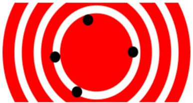

[multipage-level=2]
= Data Processing
[NOTE.objectives]
In the data processing module, you will familiarize yourself with the concept of fit-for purpose datasets and some commonly used data filters that you may want to consider for creating your own fit-for-purpose dataset. 

== Fit-for-purpose data
Correctness and Consistency are two ways of documenting data errors and are measures of data quality. 
These are measures of how well the data gatherer was able to capture the true value being investigated. 
The nature of GBIF's data publication workflow means that the correctness and consistency of the data can vary dependent on the data publishers and the source of the data.
Knowing these properties of the data you have, will help you to understand the ways in which you can and cannot clean, validate and process the data.

* Correctness (Accuracy) - closeness of measured values, observations or estimates to the real or true value e.g. has the species been identified correctly or the collection locality been identified correctly i.e.  “How close the recorded values is to the actual value”.

In the diagram it’s how close is the shot to the centre of the target.

* Consistency (Precision) - level of resolution of the data e.g. precision of coordinates, taxonomic determination i.e. “How often you get it right”

In the diagram it is how close the shots are together irrespective of how near they are to the centre of the target.

For most analyses you want highly accurate data although the level of precision may vary dependent on your analysis.
GBIF can help you to determine the accuracy and precision of the data through, for example, filters and issue flags, however, you must always double-check!

=== Data Processing Tools
As outlined in 'Software Tools'you should use tools appropriate for you for processing your data post donwload. 
While GBIF filters will allow for some data processing, it is highly recommended that you additional data processing including a data visualisation step. 
Tools that can be used for this are: 

* Spreadsheet editing software e.g. Excel, Google Sheets (smaller datasets)
* OpenRefine
* R packages and scripts eg CoordinateCleaner, scrubr and biogeo (automated data processing)
* Geographical Information Systems (GIS) 

== Handling Taxonomic Uncertainty

Uncertainty surrounding the taxonomy of a data point can arise for several reasons:

* Species misidentification
* Synoynmy
* Novel names

=== Species mis-identification

Species identification is a complex process, with species described from a certain set of characters identified in a published species description and linked to a type specimen held within a scientific collection that be used for validation of species identification. Where taxa are very similar or a set of complex traits are required for correct identification, specific taxonomic expertise may be required that data publishers may not possess leading to mis-identification of species. As users, you must have a clear understanding of how taxonomic determinations for your interest group are made:

* what are the characters used for defining the species? Are these characters easily confused or captured when the species is observed or collected?
* Are there related species that could be easily confused with the species you are interested in? 

If you think that there is a risk that species may be incorrectly identified, you can take a conservative approach to the data you use and only use those data linked to specimens in collections where taxonomic validation would be possible and eliminate other data sources. Another approach may be to use associated data such as collector information, media, DNA sequences etc to validate the taxonomic determination.

=== Synonymy 

Synonymy can arise when the same species has been described several times and with each time a new name was given to the species, or when there is a change in the taxonomy of a species for example, a species is moved from one genus to another. Only one species name can be accepted, and other names are what we call synonyms. These synonyms may still be in use to a lesser or greater extent and you should be sure when getting data from GBIF to obtain data for the taxonomic name you need. GBIF's taxonomic backbone differentiates between accepted scientific names and synonyms, and unique identifiers in the form taxon keys. Species searches https://www.gbif.org/species/search allow for filtering for accepted names and synonyms and taxon keys can be used for programmatic searches of GBIF.

=== New names

There may be instances where the scientific name does not match any name in the GBIF backbone, perhaps because the species is newly described, or is not within a checklist used by GBIF to construct its backbone or it has been misspelled or badly formatted. These names are flagged with the TAXON_MATCH_HIGHERRANK flag indicating that the scientific name has not been recognised but that the data point has matched at a higher taxonomic level eg. genus or family. This flag can be used for identifying and filtering for these these data.

There is also a TAXON_MATCH_FUZZY flag that can be used for identifying and filtering names that can only match the taxonomic backbone using a fuzzy, non exact match.

Taxon Keys
If you are accessing GBIF-mediated data programatically as opposed to via the website, taxon keys provide an effective way for defining searches based on taxonomy. 
Scientific names can be messy. So it may make sense to sort out the species by their unique taxon keys provided during the indexation of the dataset by GIBF. 
Taxon keys are issued at the species, genus family, order, phylum and kingdom level. Unique identifiers are issued to accepted names with synonyms of those accepted names issued the same identifier.  
Takon keys allow for discerning between In the previous GBIF API and the version of rgbif that wrapped that API, you could search the equivalent of this function with a species name, which was convenient. 
However, names are messy right. So it sorta makes sense to sort out the species key numbers you want exactly, and then get your occurrence data with this function. 
GBIF has added a parameter scientificName to allow searches by scientific names in this function - which includes synonym taxa. 
Note: that if you do use the scientificName parameter, we will check internally that it's not a synonym of an accepted name, and if it is, we'll search on the accepted name. 
If you want to force searching by a synonym do so by finding the GBIF identifier first with any name_* functions, then pass that ID to the taxonKey parameter.

Almost always you will want to post-process your GBIF download in some way to fit your needs. 
Here I take you through some common data quality filters. 
Sometimes you will have to make difficult judgement calls for your particular use-case. 
Whenever you are dealing with thousands-millions of records, you will never quite know the true quality of the source data. 
It is important to keep in mind that you are always just mitigating data quality issues, not eliminating them. 

== Handling Data Quality

Filtering the data allows you as a user to obtain the data that is most fit for purpose. All searches have a set of filters that can be used for finding the data you need, and occurrence searches have a set of additional 'Advanced" search filters for users that need to do more advanced filtering.  While filters may allow you to filter out data that may not be relevant, or be of lower quality for your purposes, additonal filtering may be required either manually or programmaticially to deal with additional data quality issues that arise during the GBIF data publishing model.  Below are some common data filters that you as a user might consider to make the data more fit-for-purpose. 

=== Geospatial Filters & Issues

The data can be filtered spatially in an occurrrence search in one of 3 ways:

* Country or area/Continent - data is filtered by country and will include data within the Exclusive Economic Zone (EEZ)
* Administrative area - this filter uses the GADM database https://gadm.org/data.html of administrative areas for all countries in the world to allow for 
GBIF removes common geospatial issues by default if you choose to have data with a location.
* Location - this filter allows you to filter for data with coordinates and/or draw your own polygon shape filters or use a GeoJSON file to delimit your own shape filter. If you filter for those data with coordinates, a number of geospatial issues associated with the data publishing workflow will be eliminated. These are:

** Zero Coordinates- Coordinates are exactly (0,0) or what is sometimes called "null island". Zero-zero coordinate is a very common geospatial issue. GBIF removes (0,0) when hasgeospatialissue is set to FALSE.  
** Country coordinate mis-match - Data publishers will often supply GBIF with a country code (US,TW,SE,JP…). GBIF uses the two letter system. 
https://en.wikipedia.org/wiki/ISO_3166-1_alpha-2. When a point does not fall within the country’s polygon or EEZ, but says that it should occur within the country, it gets flagged as having “country coordinate mis-match” and will be removed if data are filtered for locations.
** Coordinate invalid - If GBIF is unable to interpret the coordinates i.e. the coordinates .
** Coordinate invalid - The coordinates are outside of the range for decimal lat/lon values ((-90,90), (-180,180)).

 Country centroids

Country centroids are where the observation is pinned to center of the country instead of being closer to where the animal, plant, or microbe … was observed or recorded.  Country centroids are usually records that have been retrospectively given a lat-lon value based on a textual description of where the original record was located. So if the record simple says “Brazil”, some publishers will put the record in the center of Brazil. Similarly if the record simply says “Texas”, “Paris” … the record will go in the center of those regions. This is almost exclusively a feature of museum data (PRESERVED_SPECIMEN), but it can also happen with other types of records as well. 
Geocoding software uses gazetteers. A gazetteer is a geographical dictionary or directory used in conjunction with a map or atlas.

CoordinateCleaner is an R package for “cleaning up” GBIF occurrences. 
There are a few very helpful functions there especially for removing country centroids.
CoordinateCleaner is especially helpful for removing country centroids. 

Uncertain location 

Often you will want to be sure that the coordinates give a certain location and are not really 1000s of km away from where the organism was observed or collected. There are two fields (corrdinate precision and coordinateUncertaintyInMeters you get with a SIMPLE CSV download that you can use to filter by “uncertainty”. These fields are not used very often by publishers who feel that their records are fairly certain. But in fact it would be very helpful for users, if all publishers tried to fill in one of these fields. 

I recommend not filtering out missing values, since the value is often not filled in by publishers if they think the occurrence is fairly certain (from a GPS). 
There are a few “fake” values for coordinate uncertainty that you should be aware of. These values are errors produced by geocoding software and do not represent real uncertainty values. In the case of 301, the uncertainty is often much-much greater than 301 and actually represents a country centroid.

Points along the equator or prime meridian

Some publishers consider zero and NULL to be equivalent, empty latitude and longitude end up being plotted along these two lines.

=== Absence records

Sometimes data publishers will include absence records (where they verify that a species in not present). Most of users don’t want these records.
GBIF now has a field for classifying a record as present or absent. 
99% of users will want to have only presence records, so no GBIF gives it to you as the default. 
If you want to make sure you only got presence records, you can include this filter. 

=== Fossils and Living Specimens

GBIF has Fossils and Living Specimens (usually a plant inside a botanical garden or sometimes and animal in a zoo).  Most users do not want fossils or plants in botanical gardens. This filter will remove some of these cases. This will not remove all such cases, since some publishers will not fill in the basis of record field correctly. 
establishmentMeans
dwc:establishmentMeans : The process by which the biological individual(s) represented in the Occurrence became established at the location.
Unfortunately not used very often.
This field could allow you to remove records that are not naturally established. Publishers to not fill in this field very often, but there are cases where removing “MANAGED” records will remove zoo records.

=== Old Records

GBIF has many museum records that might be older than what is desired for some studies.

=== Remove duplicates

For your application it might be important to remove duplicate records.

== Advanced filtering

There are other things to consider when post processing GBIF data, such.  
Here are some additional things you might want to do to your data. These things are little bit more complex and involve more judgement calls, so I leave them out of the main cleaning pipeline script. 

=== Outliers
I have found the DBSCAN to be an effective way to detect points that might be outliers. 

=== Metagenomics
Metagenomics datasets sample the environment for DNA and then match the samples against an existing reference database. Especially with non-microorganisms these matches can often be incorrect or suspicious. GBIF has changed its processing so this typically is not a large problem anymore. 

Currently, there is not a great way for filtering for only metagenomics datasets. 

=== outside native ranges

=== gridded datasets
Most publishers of gridded datasets actually fill in one of the following columns: coordinateuncertaintyinmeters, coordinateprecision, footprintwkt
So filtering by these columns can be a good way to remove gridded datasets.
GBIF has an experimental API for identifying datasets which exhibit a certain about of "griddyness". You can read more here

=== automated identifications

