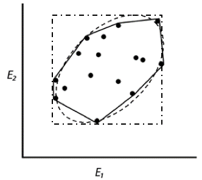
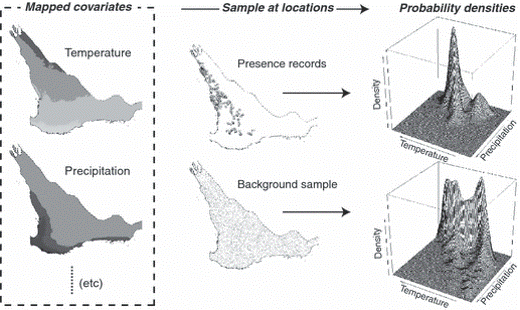
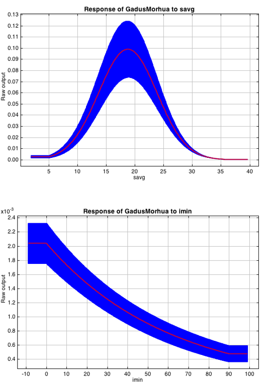
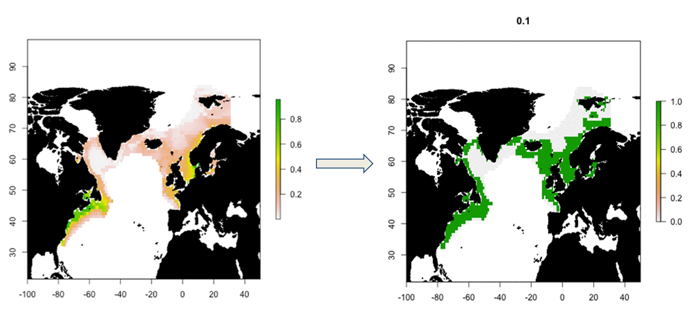
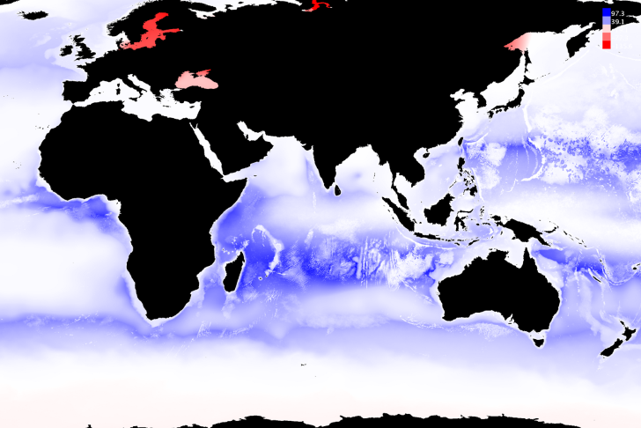

[multipage-level=2]
= Ecological Niche Models
[NOTE.objectives]

== What is an ecological niche model?
An ecological niche model is an equation or set of equations that describe the ecological niche of a species.
Niche modeling essentially does quantitatively, what natural historians do qualitatively.
The models predict suitable habitat for a species in geographic space.
Models identify the characteristics of where a species has been found or observed and use that information to predict where else might be suitable habitat.
Modelling approaches allow for the inference of a species without the need for experimental manipualtion that may be too costly, logigistically impossible and/or unethical. These approaches also allow us to use existing data that we may have collected or observed ourselves, harvested from literature or obtained from data aggregators such as GBIF. 

The following video outlines the different concepts of a niche.

*Uses*
Beyond defining the limits of a species niche, ecological niche models have a number of practical uses including:

* The designation of protected areas - comparisons of protected area coverage and niche models of interest species can identify gaps in protected areas coverage that merit increased protection.   
By stacking niche models for different species, we can also identify areas where biodiversity is concentrated and maximise the protection of as many species as possible e.g. Leathwick et al., 2008

* Invasive species management - We can build niche models of known occurrences of an invasive species within its native range and project this information into regions of potential invasion to determine the potential invasive threat of the species e.g. Carlos-Júnior et al., 2015.

* Climate change mitigation - using models to define the characteristics of a species' niche, we can then predict the availability of suitable habitat under different climate scenarios and thus infer the impacts of climate change e.g. Aguilar et al. 2015

*Commonly used algorithms*

*BIOCLIM*

* Very simple
* Infer rectilinear envelope
* Everything inside is suitable
* Not very predictive
* Randomly samples from occurrences as well as areas the species can potentially occur but has not been observed. 

*Maxent*

* Randomly samples from presence records and “background”
* Background = areas the species can experience
* Uses these samples to iteratively develop and test a model
* A series of equations that best fit the data
* Randomly samples from occurrences as well as areas the species can potentially occur but has not been observed. 
 

== Environmental variables

Environmental variables, also known as environmental data, explanatory variables, bioclimatic data or covariates are anything that can be summarized by a raster (gridded dataset).
These variables are used to characterize the niche of a species.
The data can be either continuous or categorical (i.e. data expressed as vectors), direct measurements or derived products, static or dynamic or terrestrial, aquatic or atmospheric. 
The tables below give examples of each data type. 

// [width=100%]
[cols="50%,50%"]
|===
|Continuous |Categorical 

|Cell in column 1, row 2
|Cell in column 2, row 2
|=== 

// [%autowidth.stretch]
[cols="50%,50%"]
|===
|Direct Measurement |Derived Product 

|Remotely sensed data (raw), weather station data
|climatology data, GCMs, derived remotely sensed data 
|=== 

// [%autowidth.stretch]
[cols="50%,50%"]
|===
|Static |Dynamic

|Altitude, bathymetry, slope, aspect, soil charecteristics
|temperature, precipitation, sea surface height
|=== 

// [%autowidth.stretch]
[cols="25%,25%,25%,25%"]
|===
|Terrestrial |Aquatic |Freshwater |Atmospheric  

|Climate, terrain, vegetation/land cover, soil
|Sea surface temperature, bathymetry, pH, salinity
|Flow rates, accumulation, temperature
|Wind (UV), radiation
|=== 

*Common sources of data*

* WorldClim (Terrestrial)
* EarthEnv  (Terrestrial and Freshwater)
* Bio-Oracle (Marine)
* National Geophysical Data Center (Terrestrial and Marine)
* National Snow and Ice Data Center (Terrestrial and Marine
* World Ocean Atlas (Marine)
* Raw GCM outputs  (ALL)

WorldClim is the most commonly-used climate data consisting of 19 derived bioclimatic variables (“BioClim”). 
These are typically divided into “quarters” (warmest quarter, direst quarter) and are related to seasonality.
WorldClim also produces past and future modeled climate
* Past:  HCO, LGM, LIG
* Future:  to 2100 AD

But there are other sources e.g. http://ecoclimate.org/ that stretch back farther.
These are often not just climate models but also models of land position/amount.
These past and future models differ in that past models are parameterized and testable using direct evidence, whereas future models are based on forcing variables (e.g. CO~2~)

=== Selecting covariates (or environmental variables)

More environmental data isn’t always better.  
You want to balance to achieve a balance between the number of data points and the number of environmental variables so that you do not overfit you model.
When selecting variables we want to be sure that:
* our variables are biologically relevant
* our variables are not highly correlated
* we do not use all 19 Bioclim variables

Selection is typically a 2 step process

. Initial covariate selection: Identify any very highly correlated variables. 
For each highly correlated pair, drop the least biologically relevant.
. After environmental data are extracted to species occurrence data, assess correlation again. 
Again, for each highly correlated pair, drop the least biologically relevant.

Importantly, spatio-temporal resolution and covariate data extent should align with:

* the limitations of other input data (e.g., available usable occurrence data)
* the scope of the base question(s)/hypotheses

For example, if your environmental data have a spatial resolution of 10 Arc Minutes and a temporal resolution between 1955 and 2006, then the temporal and spatial resolution of the GBIF-meadited data you are going to use should correspond to those resolutions. 

=== Training (model calibration) regions

Training regions in Maxent (and other ENM algorithms) are the areas from which these algorithms sample the background for model inference.

Considerations when determining a training region for your model are:

* Where did species originate?
* Dispersal ability
* Distance
* Biogeographic barriers
* it should not be a rectangle
* it should not correspond to political boundaries
* it should not be a coarse range delimitation (e.g. range map) 
* it should reflect available geographic regions that could have been sampled by the study species during the relevant time period
* Bigger is not better

== Interpretation and Post-Processing of Niche Models

*Variable Response Curves*

Variable response curves are model outputs that estimate the suitability of each variable. 

Approximately normal curves may indicate better estimates of the fundamental niche although some variables such as ice concentrations do not work like that (very few species can live enclosed in ice!)

*Model evaluation*
In the ideal modeling scenario... You would seek to identify the ideal model calibration for your data and modeling intent, by comparing: 

* multiple calibration scenarios for an individual algorithm and 
* the best model calibration scenario across multiple algorithms

In the use cases, where you will be dipping your toes into the major theoretical concepts underpinning ENM/SDM, you'll be looking at only 1 algorithm.

Many options exist for evaluating model calibration scenarios.

Common and accepted approaches are:

* Akaike Information Criterion (AIC): 
** Compares and identifies the best model calibration scenario for an individual statistical algorithm
** Balances model fit with model complexity
** can NOT be used to compare between different algorithms

* Omission Rate (OR): 
** Compares model performance across algorithms

*Akaike Information Criterion (AIC): Assessing within algorithm performance* 
AIC is a log likelihood based evaluation metric, commonly used within regression methods.
We can evaluate the performance of a model i.e. “which model performed better” through:

* Model with the lowest AIC
* Models within 2 points of each other do not differ significantly.
You will need to look at other factors (e.g., variable contribution) that may suggest which (if any) of the equivalent models is more ideal

AICc = AIC corrected
     Corrected to account for 
     smaller, finite sample sizes
delta.AICc = difference in AICc 
     between the models being 
     compared
w.AIC = AIC weight

*Omission Rate (OR): Assessing across algorithm performance*
OR is a method of evaluating a model’s ability to accurately predict to test data (typically after applying a threshold)
When OR = 0, then no presences were predicted as absent.

=== Thresholding a Niche Model
Thresholding is the process by which we convert the continuous (raw) output from a statistical model to a binary output. 
The binary output is generally interpreted as areas that are suitable/not suitable for the species.

We choose the “threshold” value that determines a presence versus an absence of the species using the:
-	Minimum Training Presence (MTP)
-	MTP + user-selected error rate (e.g., E=5%, E=10%)

The precise method by which you do this depends on your data.

[cols="1,1,1"]
|===
|  |Species is present |Species is absent 

|Model predicts species as present
|Accurate
|Type 1 Error (commission)

|Model predicts species as absent
|Type 2 Error (omission)
|Accurate
|=== 

Classification

•	Sensitivity
•	True positive rate
•	Specificity
•	True negative rate
•	Would you rather throw out milk that was fine, or drink milk that had spoiled?
Thresholds: a Tradeoff
•	Threshold -> 100
	- all areas are suitable
	- high commission errors
	- omission error goes to 0
•	Same in converse

== Projecting a Niche Model

You project a niche model when you map your model onto the training region to find additional suitable habitat. You can also map your model into the past or the future or into novel environments. You are asking, where can the species persist?

Projecting to your training region is the most common and simplest form. 
However, you can also project into different contemporaneous geographies to, for example:

* target sampling in undersurveyed regions for rare organisms e.g. de Siqueira et al. 2009
* predicting the existence of sister species e.g. Owens et al. 2013
* predicting the invasive potential of introduced species. 

We can also project into the past and the future, for example:
* to hindcast distributions in the case of determining paleodistributions of modern taxa for identifying refugia e.g. Peterson and Nyári, 2007
* to forecast species distributions to identify range shifts due to cliamte change e.g. Wang et al., 2016.

*What happens when a model is projected into novel environments?*

The Big Caveat
Novel environments
* climate conditions not found in model training region
Truncation
* Cut off suitability response
Clamping
* Suitability remains continuous
Extrapolation
* Use model equations to predict change in suitability outside training region

*Projection Uncertainty*

MESS: Multivariate Environmental Suitability Surface identifies areas of extrapolation i.e. areas in the projected ecological model that are unlikely to be suitable for the species. These are show as red on the map and can be produced when using Maxent.

Paragraph1, sentence1.
Sentence 2.
Sentence 3.

Paragraph2, sentence1.
Sentence 2.
Sentence 3.

Paragraph3, sentence1.
Sentence 2.
Sentence 3.

=== sub topic

[NOTE.presentation]
Watch video on the key concepts of ...

.In this video (12:26), you will review ... used in this course. 
If you are unable to watch the embeded Vimeo video, you can download it locally. (MP4 - 44.5 MB)
video::434713215[vimeo, height=480, width=640, align=center]

[NOTE.activity]
Become familiar with the ...

****
this is an example of a block
this second sentence

this is second paragraph first sentence.
this is second sentence
****

==== sub sub topic

Paragraph1, sentence1.
Sentence 2.
Sentence 3.

“Paragraph2, sentence1.
Sentence 2.
Sentence 3.
