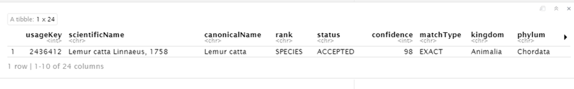
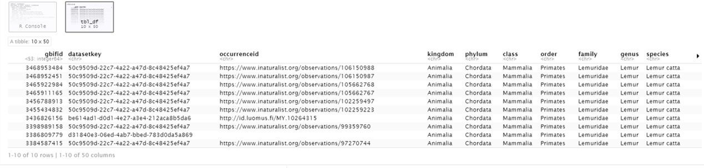
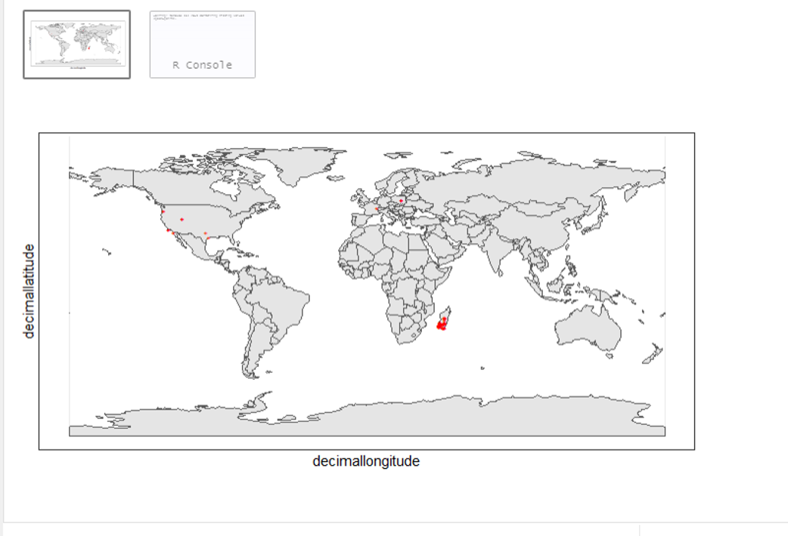
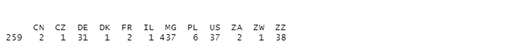
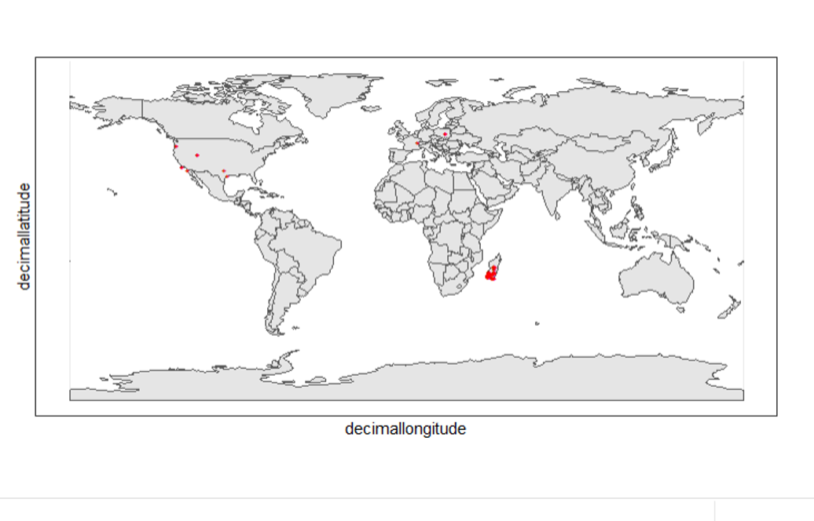
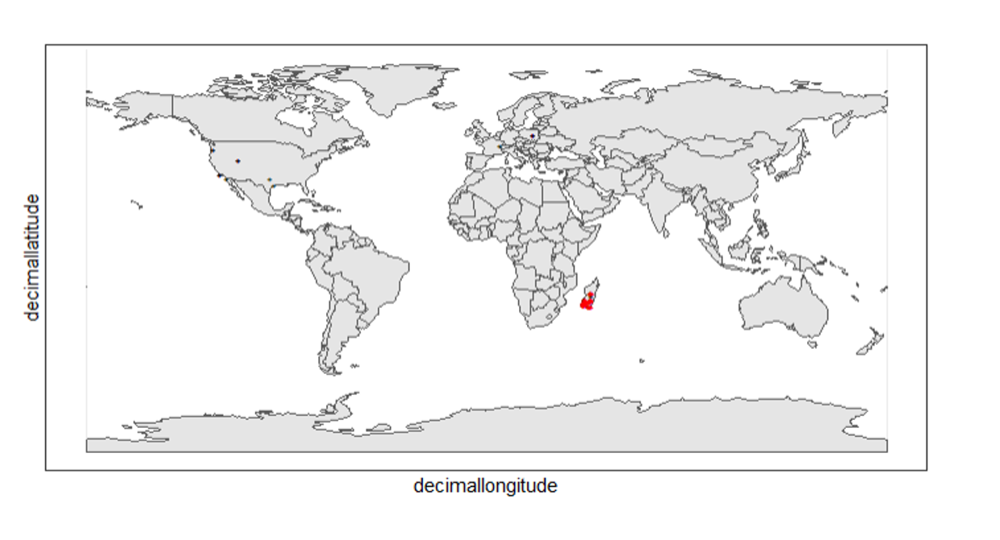
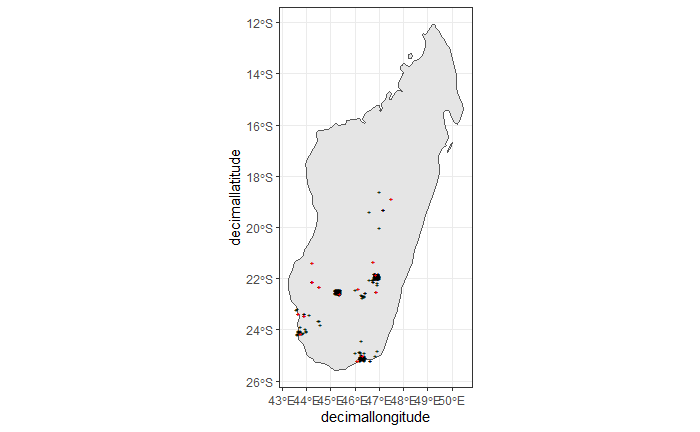
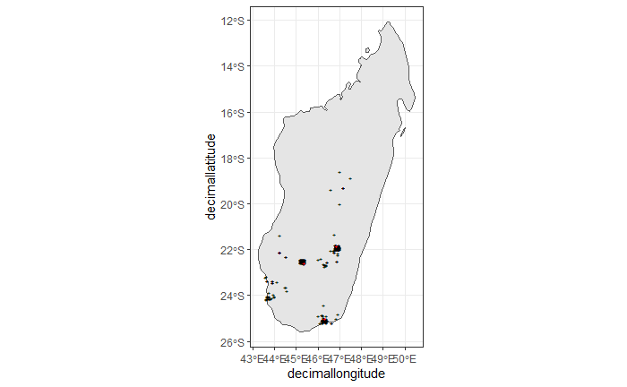

This is an example script that can be used for developing your own data processing pipelines.  The script take you through the process of downloading, visualizing and cleaning GBIF-mediated data. Remember that this script is only a tool and that, utlimately, it is you the user to ensure that the data is fit for purpose.   

You can download the R Markdown document for your own use here - link:../exercise-data/Lemur_catta_project.Rmd[_Lemur catta_ project, opts=download]

---
# GBIF -- data processing

Author: Arman Pili

---
The following packages will be needed

```{r, message = FALSE}
                            #notes
library(rgbif)              #for downloading datasets from gbif
library(countrycode)        #for getting country names based on countryCode important
library(rnaturalearth)      #for downloading maps
library(sf)                 #for manipulating downloaded maps
library(tidyverse)          #for tidy analysis
library(CoordinateCleaner)  #for quality checking of occurrence data
```
# Preparing plotting variables

These will return the variables you will need for plotting your data later

### Downloading world map

```{r}
world_map <- ne_countries(returnclass = "sf")
```

### Downloading map of Madagascar

```{r}
country_map <- ne_countries(country = "Madagascar",
                            scale = "medium",
                            returnclass = "sf")
```

# Dowloading GBIF datasets

### Looking up species taxon keys

I chose to use the Ring-Tailed Lemur (*Lemur catta*) for demonstrative purposes.

```{r, message = FALSE}
name_backbone(name = "Lemur catta", rank = "species")
```


In the next step, you will need a taxon key. Here, the taxon key is equivalent to the usageKey.

What is the usageKey of Lemur catta?

```{r}
usageKey <- 2436412
# alternatively 
usageKey <- name_backbone(name = "Lemur catta", rank = "species") %>% 
                 pull(usageKey)

```


Looks like there are a lot of possible taxon keys for *Lemur catta*. I searched it in GBIF taxonomic backbone instead: 2436412

### Sending request to download file

Remember to fill in your own GBIF login credentials for "user", "pwd" and "email"  

```{r}
gbif_download_key <- occ_download(pred("taxonKey", 2436412),
                              format = "SIMPLE_CSV",
                             user = "*****",
                             pwd = "******",
                             email = "*******")
```


### Actually downloading the file

```{r}
occ_download_wait(gbif_download_key)

gbif_download <- occ_download_get(gbif_download_key, 
                                  overwrite = TRUE) %>% 
                 occ_download_import() %>% 
                 setNames(tolower(names(.)))

head(gbif_download, 10) #view first ten rows
```


### Retrieving the citation of the downloaded dataset to use in your report

```{r}
print(gbif_citation(occ_download_meta(gbif_download_key))$download)
```

# Data Visualization

*Lemur catta* is native to Madagascar; but just to make sure, let's check where else it can be found 

```{r, message = FALSE, error = FALSE}
ggplot() +
  geom_sf(data = world_map) +
  geom_point(data = gbif_download,
             aes(x = decimallongitude,
                 y = decimallatitude),
             shape = "+",
             color = "red") +
  theme_bw()
```


From initial look, what's wrong with the distribution of the Lemur?

Wheps! seems like there are unusual occurrences outside its native range. Let's check further.

```{r}
table(gbif_download$countrycode)
```




# Data cleaning step 1

With each step note the number of records that you are removing

Removing data recorded based on fossil or living specimens, and records from alien/invasive populations

```{r}
clean_step1 <- gbif_download %>% 
  as_tibble() %>% 
  filter(!basisofrecord %in% c("FOSSIL_SPECIMEN", 
                               "LIVING_SPECIMEN"),
         !establishmentmeans %in% c("MANAGED", 
                                    "INTRODUCED", 
                                    "INVASIVE",
                                    "NATURALISED"))
print(paste0(nrow(gbif_download)-nrow(clean_step1), " records deleted; ",
             nrow(clean_step1), " records remaining."))
```

### Plotting raw records vs. cleaned records (step 1)

```{r}
ggplot() +
  geom_sf(data = world_map) +
  geom_point(data = gbif_download,
             aes(x = decimallongitude,
                 y = decimallatitude),
             shape = "+",
             color = "black") +  
  geom_point(data = clean_step1,
             aes(x = decimallongitude,
                 y = decimallatitude),
             shape = "+",
             color = "red") +
  theme_bw()
```



# Data cleaning step 2

Flagging records with problematic occurrence information using functions of the coordinatecleaner package.

```{r, message = FALSE}
clean_step2 <- clean_step1 %>% 
  filter(!is.na(decimallatitude),
         !is.na(decimallongitude),
         countrycode == "MG") %>% # "MG" is the iso code for Madagascar
  cc_dupl() %>% 
  cc_zero() %>% 
  cc_equ() %>% 
  cc_val() %>% 
  cc_sea() %>% 
  cc_cap(buffer = 2000) %>% 
  cc_cen(buffer = 2000) %>% 
  cc_gbif(buffer = 2000) %>% 
  cc_inst(buffer = 2000)
print(paste0(nrow(gbif_download)-nrow(clean_step2), " records deleted; ",
             nrow(clean_step2), " records remaining."))  
```

### Plotting raw records vs. cleaned records (step 2)

```{r}
ggplot() +
  geom_sf(data = world_map) +
  geom_point(data = gbif_download,
             aes(x = decimallongitude,
                 y = decimallatitude),
             shape = "+",
             color = "black") +  
  geom_point(data = clean_step2,
             aes(x = decimallongitude,
                 y = decimallatitude),
             shape = "+",
             color = "red") +
  theme_bw()
```



The black "+" markers indicate the occurrences of the raw dataset; whereas the red "+" markers indicate the occurrences of the cleaned dataset.

### Zooming in to madagascar


```{r}
ggplot() +
  geom_sf(data = country_map) +
  geom_point(data = gbif_download,
             aes(x = decimallongitude,
                 y = decimallatitude),
             shape = "+",
             color = "black") +  
  geom_point(data = clean_step2,
             aes(x = decimallongitude,
                 y = decimallatitude),
             shape = "+",
             color = "red") +
  coord_sf(xlim = st_bbox(country_map)[c(1,3)],
           ylim = st_bbox(country_map)[c(2,4)]) +
  theme_bw()
```

image::img/web/lemur_madagascar.png[align=center,width=650,height=450]

# Data cleaning step 3

Removing records with coordinate uncertainty and precision issues

```{r}
clean_step3 <- clean_step2 %>% 
  filter(is.na(coordinateuncertaintyinmeters) |
           coordinateuncertaintyinmeters < 10000,
         is.na(coordinateprecision) |
           coordinateprecision > 0.01)

print(paste0(nrow(gbif_download)-nrow(clean_step3), " records deleted; ",
             nrow(clean_step3), " records remaining." ))  
```

### Plotting raw records vs. cleaned records (step 3)

```{r}
ggplot() +
  geom_sf(data = country_map) +
  geom_point(data = gbif_download,
             aes(x = decimallongitude,
                 y = decimallatitude),
             shape = "+",
             color = "black") +  
  geom_point(data = clean_step3,
             aes(x = decimallongitude,
                 y = decimallatitude),
             shape = "+",
             color = "red") +
  coord_sf(xlim = st_bbox(country_map)[c(1,3)],
           ylim = st_bbox(country_map)[c(2,4)]) +
  theme_bw()
```



Oh no! we only have 14 records left.


# Data cleaning step 4

Further removing records with temporal range outside that of our predictor variables

```{r}
clean_step4 <- clean_step3 %>% 
  filter(year >= 1955) # WorldClim temporal range is 1970 to 2000s tho
print(paste0(nrow(gbif_download)-nrow(clean_step3), " records deleted; ",
             nrow(clean_step4), " records remaining." )) 
```


```{r}
ggplot() +
  geom_sf(data = country_map) +
  geom_point(data = gbif_download,
             aes(x = decimallongitude,
                 y = decimallatitude),
             shape = "+",
             color = "black") +  
  geom_point(data = clean_step4,
             aes(x = decimallongitude,
                 y = decimallatitude),
             shape = "+",
             color = "red") +
  coord_sf(xlim = st_bbox(country_map)[c(1,3)],
           ylim = st_bbox(country_map)[c(2,4)]) +
  theme_bw()
```



Oh noooooo there are just three records left! You may not have enough data points for what you want to do. You can always go back to your pipeline and refine.

