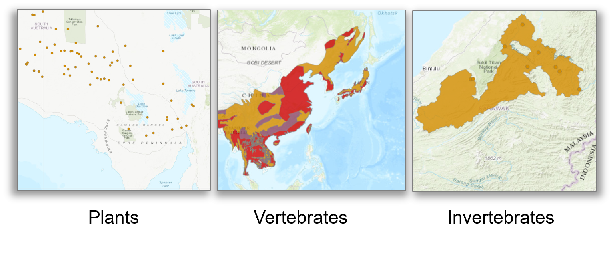

[multipage-level=2]
= Assessing the conservation status of a species 
[NOTE.objectives]
This module will introduce you to the basic concepts and terminology associated with assessing the conservation status of a species using the IUCN Red List Categories and Criteria.  
By the end of the module, you should understand  the conceptual framework of the IUCN Red List of Categories and Criteria and how you can apply them using GBIF-mediated data.
This module does not cover the entirety of the Red List assessment process but focuses on how GBIF-mediated data can be used within these processes. 
For a complete training you should complete the link:https://www.conservationtraining.org/course/index.php?categoryid=23[online IUCN Red List training course]. 

== IUCN Red List of Threatened Species

The International Union for Conservation of Nature (IUCN) Red List of Threatened Species provides a robust and transparent framework in the form of the link:https://www.iucnredlist.org/resources/categories-and-criteria[IUCN Red List Categories and Criteria] for estimating the risk of extinction of all taxa (excluding microorganisms and taxa below subspecies) across all systems -  marine, terrestrial and freshwater.
It is an internationally recognised standard that can be applied at global, regional and national scales and is acknowledged as a key tool for assessing progress towards achieving bodiversity targets as set out in the Convention on Biological Diversity. 

image::img/web/Red_list.png[align=center,width=640,height=360]

All species have a probability of going extinct due to random events.  
However, some species have a higher probability of extinction due to a number of determining factors such as population trends, range and threats faced by the species. 
The IUCN Red List Categories and Criteria provides a framework against which this extinction risk can be assessed.

=== IUCN Red List Categories and Criteria

Assessments are based on 5 objective, scientific criteria, each containing a set of quantitative thresholds against which the risk of extintion of a species can be assessed.  Species must be assessed against all criteria during an assessment.

These 5 criteria are:

* Criterion A - Popluation reduction
* Criterion B - Restricted geographic range
* Criterion C - Small population size and decline
* Criterion D - Very small or restricted population
* Criterion E - Quantitative analysis

Each of these criteria has a set of associated thresholds for these biological traits that allow assessors to assess the risk of exinction for that species and apply one of 9 categories.  

image::img/web/iunccategories.png[align=center,width=640,height=360]

All criteria shoudl be applied to a taxon during an assessment and it is the criterion with the highest threat category that is used as the final Red List assessment.

== Global vs National Red List Assessments

The IUCN Red List of Categories and Criteria were developed for applying at a global level i.e. to take into account a species entire global distribution that may cross international borders. The majority of species currently on the link:https://www.iucnredlist.org/[IUCN Red List] are global assessments. However, species can be assessed at a regional, national or local level and for these, assessors should use the link:https://www.gbif.org/publishing-data[Guidelines for Application of IUCN Red List Criteria at Regional and National Levels^], an adaptation of the global Categories and Criteria. These regional guidelines provide additional guidance on:

- Deciding on which species should be assessed at a regional, national or local level
- Additional categories for assessments at a regional, national and a local level
- Assessing breeding vs non-breeding species at a regional, national and a local level
- Integrating information on the species from across its global distribution in regional, national and a local assessments.

It should be noted that regional, national or local assessments of species that are endemic to those regions are, by default, global assessments and no additional regional correction is needed. 

It is important to realise that while these guidelines are in place to assist with regional and national assessments, national and regional red lists may not have followed the IUCN guidelines for assessing species.  For more information about national Red Lists published by countries around the world, see the link:https://www.nationalredlist.org/[National Red List] website.

=== Red List assessment process 

Assessments that are to be integrated into the global IUCN Red List of Threatened Species can come from coordinated efforts within the IUCN network e.g. link:https://www.iucn.org/commissions/ssc-groups[IUCN Species Survival Commission Specialist Groups] or from other processes such as the development of national Red Lists, if there are species that are being assessed that are endemic to that country. National Red Listing processes may differ from those prescribed by IUCN, but ANY assessment to be submitted to the global IUCN Red List of Threatened Species will have to go throught the following stages:

* Assessment - Assessors are experts who have sufficient knowledge of a taxon to be able to apply the criteria in an informed way, these experts can come from within the IUCN network such as the link:https://www.iucn.org/commissions/ssc-groups[IUCN Species Survival Commission Specialist Groups] or from national or regional taxonomic experts.

* Review -  Reviewers of global assessments are generally from the network of Red List Authorities (RLAs), which are mostly IUCN Specialist Groups, but where there are gaps, other organisations act as RLAs (e.g., Project Seahorse, BirdLife International, etc) and agree that they are appropriate based on all data currently available for the species. 
Assessments coming to the IUCN Red List Unit from within IUCN should already have been through the review process (the RLAs nest within the SGs). Assessments coming from outside the IUCN network need to go through the peer review process.

image::img/web/redlistprocess.png[align=center,width=640,height=360]

== GBIF-mediated data and Red List assessments 

Key to the Red List assessment process is data and the Categories and Criteria allow for the use of a range of data of heterogenous quality within an assessment. These data can be observations, estimations, projections, inferences or suspicions. 
Processed GBIF-mediated data is a source of observation data providing georeferenced locality data that can be used to calculate key metrics in the assessment process, particularly for Criterion B and for producing species distribution maps that are required to accompany assessments. 
Remember, that ALL criteria should be applied during an assessment, which is why you will ideally have additional information on population sizes and trends along with information on threats to the species. 

=== Applying Criterion B - Restricted Geographic Range

Criterion B identifies populations with restricted distributions that are also severely fragmented or occur in a small number of locations, are experiencing continuing decline, or are exhibiting extreme fluctuations. 
Taxa with very large ranges will generally have a lower risk of extinction than a species with a highly restricted distribution, which is likely to be more at risk from localised threats. 

Two of the metrics within criterion B that are used for identifying these restricted distributions are Extent of Occurrence (EOO) and Area of Occupancy (AOO).  
Extent of Occurrence is the area within the shortest continuous imaginary boundary drawn around all known, inferred, or projected sites presently occupied by the taxon. 
It is not the species range and is drawn as minimum convex polygon around the limits of a species known range.  

image::img/web/EOO.png[align=center,width=640,height=360]

Area of Occupancy is the area within the extent of occurrence that is actually occupied by the taxon. 
It is measured by overlaying a 2x2 km grid and counting the number of occupied cells.  

image::img/web/AOO.png[align=center,width=640,height=360]

Both these metrics require georeferenced locality data and GBIF-mediated data can be used for calculating both EOO and AOO of species.  
A number of tools have been developed for calculating these measurements including ArcGIS toolboxes, the R package red and GeoCat.  
The latter provides users with little programming or GIS experience, the ability to take GBIF-mediated data and calculate EOO and AOO measurements.  

=== Mapping standards for IUCN Red List Assessments

All assessments should be accompanied by a distribution map.  
Maps are included on the Red List for several reasons. 
Primarily, the maps provide a visual representation of the taxon’s distribution, so people can see where the taxon is found and help to identify priority areas for conservation and inform conservation policy. 
Different mapping standards are applied for different taxonomic groups and for whether the species is terrestrial, marine or freshwater. 
Full guidance on the application of these standards can be found on the link:https://www.iucnredlist.org/resources/mappingstandards[IUCN Mapping Standards] webpage.

image::img/web/Red_list_maps.png[align=center,width=640,height=360]

In many cases the distribution is depicted as polygons, but it may also be represented by data points (collection records), or a mixture of points and polygons. 
Polygon maps, commonly referred to as “limits of distribution” or “field guide” maps, aim to provide the current known distribution of the species within its native range i.e.  the species probably only occurs within that polygon. 
The taxon may not be distributed equally within that polygon or occur everywhere within that polygon.
These limits of distribution are determined by using known occurrences of the species, along with knowledge of habitat preferences, remaining suitable habitat, elevation limits, and other expert knowledge of the species and its range. 

=== Minimum Documentation
Assessors should provide with their maps, whether they are points, polygons or a combination of both, a set of accompanying attributes i.e. data attached to points and polygons. 
Some of these attributes are required as part of minimum documentation supporting assessments.
A full overview of these minimum documentation requirements can be found in the mapping standards guidelines on the link:https://www.iucnredlist.org/resources/mappingstandards[IUCN Mapping Standards] webpage. 
You can also find a a downloadable Excel file at the above link where attribute fields have been mapped to Darwin Core fields to highlight those fields in your GBIF downloads that fulfil minimum documentation requirements when submitting Red List assessment maps. 
