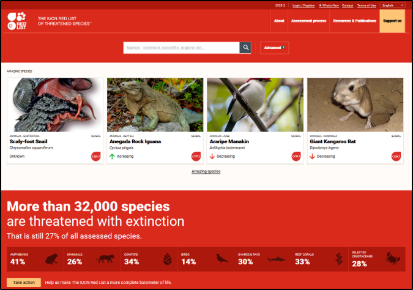
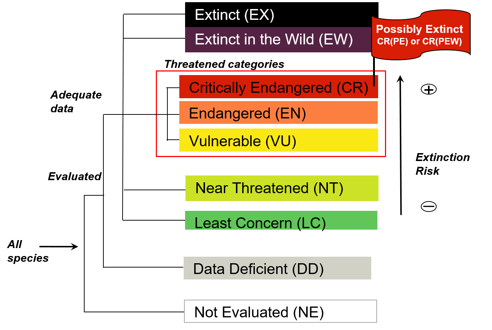
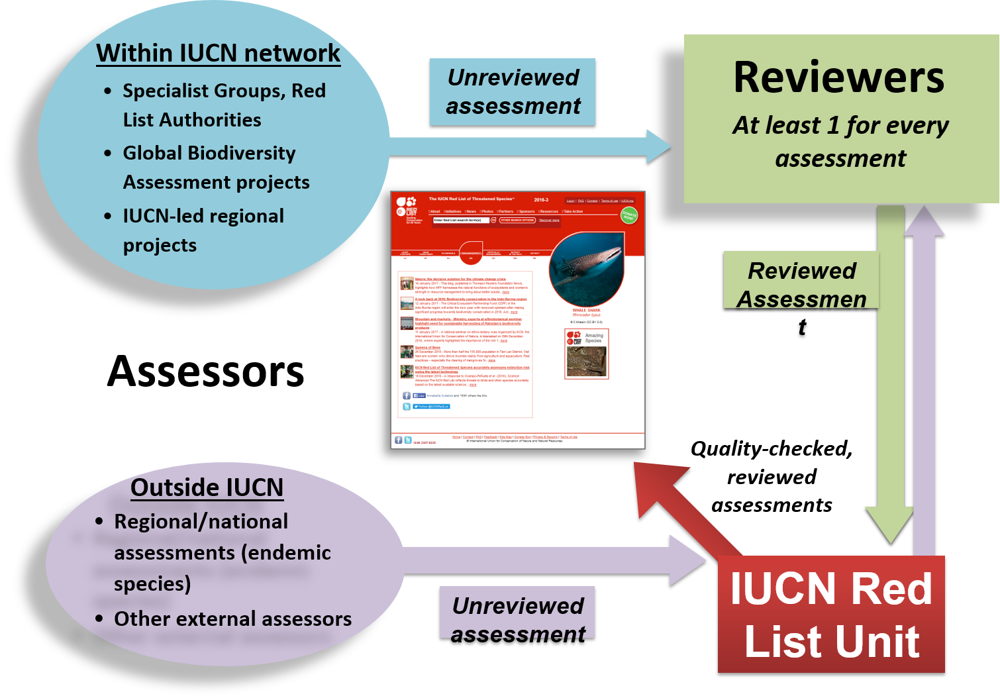
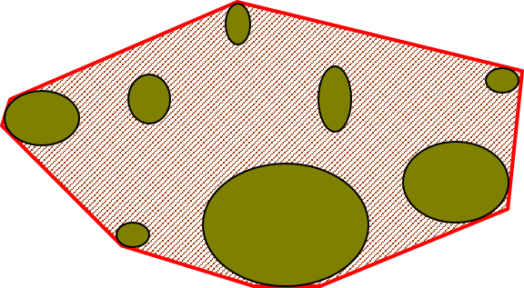
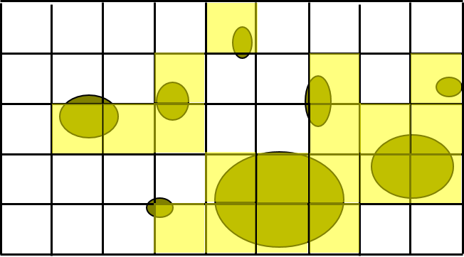

[multipage-level=2]
= Assessing the conservation status of a species 
[NOTE.objectives]
This module will introduce you to the basic concepts and terminology associated with assessing the conservation status of a species using the IUCN Red List Categories and Criteria.  
By the end of the module, you should understand what the conceptual framework of the IUCN Red List of Categories and Criteria and how you can apply them using GBIF-mediated data.
This module does not cover the entirety of the Red List assessment process but focuses on how GBIF-mediated data can be used within these processes. For a comlete training you should complete the link:https://www.conservationtraining.org/course/index.php?categoryid=23[online IUCN Red List training course]. This will also provide the additional information you will need for completing the use case associated the use case if you will not be attending a GBIF training workshop.

== IUCN Red List of Threatened Species

The International Union for Conservation of Nature (IUCN) Red List of Threatened Species provides a robust and transparent framework in the form of the IUCN Red List Categories and Criteria for estimating the risk of extinction of  all species across all systems -  marine, terrestrial and freshwater.
It is an internationally recognised standard that can be applied at a global, regional and national level and is acknowledged as a key tool for assessing progress towards achieving bodiversity targets as set out in the Convention on Biological Diversity. 

All species have a probability of going extinct due to random events.  
However, some species have a higher probability of extinction of going extinct due to a number of determining factors such as population trends, range and threats faced by the species. 
Using a set of obective, scientific criteria  quantitive thresholds, the IUCN Red List Categories and Criteria allow assessors to use knowledge of a species´ biology and the threats that the species evaluate the extinction risk of a species and assign a conservation status for that species in the form of a Category. 

=== IUCN Red List Categories and Crtiteria

Assessments are based on 5 objective, scientific criteria, each containing a set of quantitative thresholds against which the risk of extintion of a species can be assessed.  Species must be assessed against all criteria during an assessment.

These 5 criteria are:

* Criterion A - Popluation reduction
* Criterion B - Restricted geographic range
* Criterion C - Small population size and decline
* Criterion D - Very small or restricted population
* Criterion E - Quantitative analysis

Each of these criteria has a set of associated thresholds for these biological traits that allow assessors to apply one of 9 categories that indicate a species' extinction risk.  

It is the criterion with the highest threat category that is used in an assessment.

=== Red List assessment process 

Assessments that are to be integrated into the global IUCN Red List of Threatened Species can come from coordinated efforts within the IUCN network e.g. link:https://www.iucn.org/commissions/ssc-groups[IUCN Species Survival Commission Specialist Groups] or from other processes such as the development of national Red Lists, if there are species that are being assessed that are endemic to that country. National Red Listing processes may differ from those prescribed by IUCN, but ANY assessment to be submitted to the global IUCN Red List of Threatened Species will have to go throught the following stages:

* Assessment - Assessors are experts who have sufficient knowledge of a taxon to be able to apply the criteria in an informed way, these experts can come from within the IUCN network such as the link:https://www.iucn.org/commissions/ssc-groups[IUCN Species Survival Commission Specialist Groups] or from national or regional taxonomic experts.

* Review -  Reviewers of global assessments are generally from the network of Red List Authorities (RLAs), which are mostly IUCN Specialist Groups, but where there are gaps, other organisations act as RLAs (e.g., Project Seahorse, BirdLife International, etc) and agree that they are appropriate based on all data currently available for the species. 
Assessments coming to the IUCN Red List Unit from within IUCN should already have been through the review process (the RLAs nest within the SGs). Assessments coming from outside the IUCN network need to go through the peer review process.

== GBIF-mediated data and Red List assessments 

Key to the Red List assessment process is data and the Categories and Criteria allow for the use of data of heterogenous quality within an assessment. These data can be observations, estimations, projections, inferences or suspicions. 
Processed GBIF-mediated data is a source of observation data providing georeferenced locality data that can be used to calculate key metrics in the assessment process and for producing species distribution maps that are required to accompany assessments.   

=== Applying Criterion B - Restricted Geographic Range

As an assessor you must apply all 5 of the criteria to the species you are assessing, but it is for Criterion B that GBIF-medaited data pays a key role. 
Criterion B identifies populations with restricted distributions that are also severely fragmented or occur in a small number of locations, are experiencing continuing decline, or are exhibiting extreme fluctuations. 
Species with very large ranges will generally have a lower risk of extinction than a species with a highly restricted distribution, which is likely to be more at risk from localised threats. 

Two of the metrics within criterion B that are used for identifying these restricted distributions are Extent of Occurrence (EOO) and Area of Occupancy (AOO).  
Extent of Occurrence is the area within the shortest continuous imaginary boundary drawn around all known, inferred, or projected sites presently occupied by the taxon. 
It is not the species range and is drawn as minimum convex polygon around the limits of a species known range.  

Area of Occupancy is the area within the extent of occurrence that is actually occupied by the taxon. 
It is measured by overlaying a 2x2 km grid and counting the number of occupied cells.  

Both these metrics require georeferenced locality data and GBIF-medaited data can be used for calculating both EOO and AOO of species.  
A number of tools have been developed for calculating these measurement including ArcGIS toolboxes, the R package red and GeoCat.  
The latter provides users with little programming or GIS experience, the ability to take GBIF-mediated data and calculate EOO and AOO measurements.  
In the following video, we provide you with an overview of how this tool works.   

=== Mapping standards for IUCN Red List Assessments

All species assessments should be accompanied by a distribution map.  Species maps are included on the Red List for several reasons. Primarily, the maps provide a visual representation of the species’ distribution, so people can see where the species is found and help to identify priority areas for conservation and inform conservation policy.

In many cases the distribution is depicted as polygons, but it may also be represented by data points (collection records), or a mixture of points and polygons. 
For polygon maps, the polygon shows the limits of the taxon’s distribution, which essentially means that the species probably only occurs within this polygon, but it does not mean that it is distributed equally within that polygon or occurs everywhere within that polygon.
Polygon maps, commonly referred to as “limits of distribution” or “field guide” maps, aim to provide the current known distribution of the species within its native range.  
The limits of distribution are determined by using known occurrences of the species, along with knowledge of habitat preferences, remaining suitable habitat, elevation limits, and other expert knowledge of the species and its range. 

Different mapping standards are applied for different taxonomic groups and for whether the species is terrestrial, marine or freshwater. 
Full guidance on the application of these standards can be found at https://www.iucnredlist.org/resources/mappingstandards

image::img/web/Red_list_maps.png[align=center,width=640,height=360]

=== Minimum Documentation
Assessors should provide with their maps, whether they are points, polygons or a combination of both, a set of accompanying attributes i.e. data attached to points and polygons. 
Some of these attributes are required as part of minimum documentation supporting assessments and these attribute fields have been mapped to Darwin Core terms to highlight those fields in your GBIF downloads that can be used to fulfil minimum documentation requirements when submitting your red list assessments. 
A full overview of these minimum documentation requirements and mapped Darwin Core fields can be found, respectively, in the mapping standards guidelines and as a downloadable Excel file at https://www.iucnredlist.org/resources/mappingstandards. 
