[multipage-level=2]
= Use Case - Modelling Species Distributions Under Climate Change

This is a practice use case for the ecological niche modeling module developed by Dr.Hannah Owens, University of Copenhagen. For this use case, you will use the modular, R-based platform Wallace link https://wallaceecomod.github.io/ for reproducible modeling of species niches and distributions. 

The platform is powered by a variety of R packages including dismo and enmeval allows and lowers the threshold for access to basic modeling functions through a user friendly graphical user interface (GUI).
It is a great platform for getting you started in in niche modeling and will allow to learn the basics of modeling, explore your data and generate a backcbone R script that will allow for the repeatability of your analyses.  
What it will not be able to do is generate final, publishable models but it should give you a good grasp of the principles of niche modeling. 

=== Exercise 1 - Starting Wallace

First thing’s first. We’ll start by launching Wallace and giving you a quick overview of the steps you will go through to generate a niche model. 

-	Launch RStudio.     

RStudio is a helpful platform for writing and executing R code. 
You can write and save scripts, execute commands, and keep track of datafiles. 
We don’t have time to give you an exhaustive overview of all the RStudio features, but if you are curious, check out the link at the end of this exercise. 
For our purposes, the important thing for you to know is that there are four panes in RStudio, as follows (note that depending on your operating system and the version of RStudio, it may not appear exactly identical):

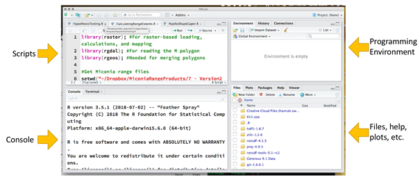

-	 Launch Wallace

a)	If you have installed Wallace, proceed to step b. If you have not installed Wallace, type the following in the console window of RStudio and hit “Enter”: 

	install.packages(“wallace”)

image::img/web/ENM_Exercise1_2.png[align=center,width=200,height=100]

b)	Type the following in console window of RStudio and hit “Enter”: 

	library(“wallace”)

c)	Type the following in console window of RStudio and hit “Enter”: 
	
run_wallace()

This should launch Wallace in an internet browser window.

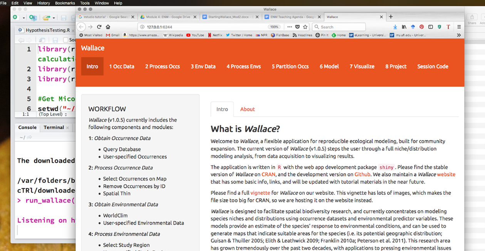

Along the top of the browser is a menu bar with each of the steps that go into generating a niche model. 
You can also see this as a workflow in the left-hand panel. 
We will follow the general outline of this workflow, but with some slight modification. 
This will be explained more as we work through generating our own niche models. 

=== Exercise 2 - Loading occurrence points

There are two options for loading occurrence data in Wallace. 
The first option is to directly query several biodiversity databases including GBIF. 
This is good for generating quick and dirty niche models to explore data, but Wallace does not allow you to clean data in all the ways we have discussed in the data processing module. 
For this reason, you can also load in your own occurrence data that you have processed using your own processing pipeline or data that is not yet served through a database connected to Wallace.  
For this exercise, we will query GBIF directly using Wallace.

a)	Click on “1 Occ Data” in the menu bar at the top of the Wallace window

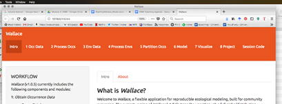

b) In the panel on the left, select the “Query Database” radio button.

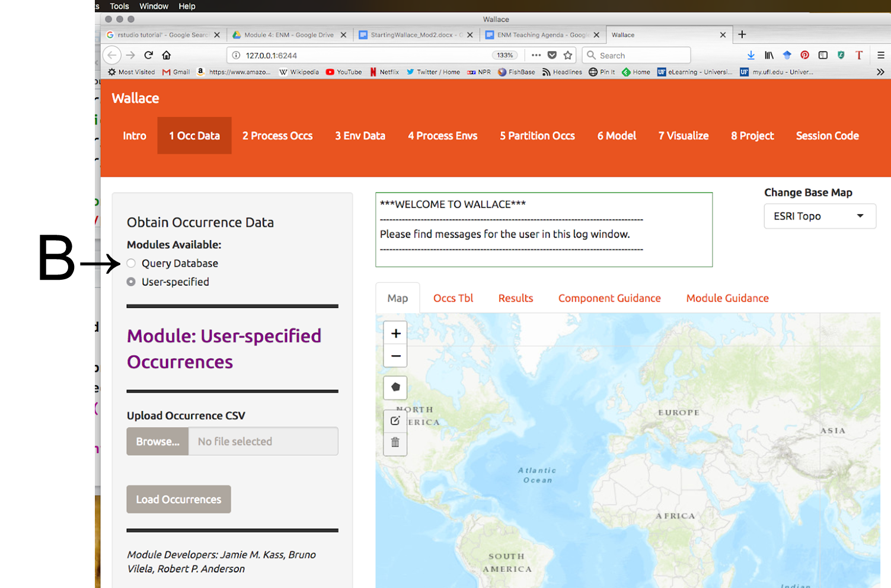

Notes on the Wallace interface: 

●	As we begin importing and processing data, a detailed record of what has been done will be recorded in the log window above the map.

●	If you need a refresher on the background of a particular modeling step, you can click on the “Component Guidance” tab

●	If you need help understanding the elements of a particular modeling step, you can click on the “Module Guidance”.

b)	Select the “GBIF” radio button and enter a species name of your choice. 
I will be using _Protea cynaroides_ for this example, in case you want to follow along exactly. 
I also increased the number of occurrences I am searching for to 10,000, because I want all the points.

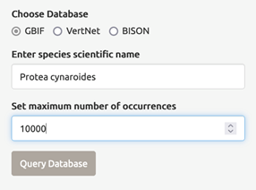

c) Click “Query database”. 
Your occurrence points should all show up as red dots on the map.

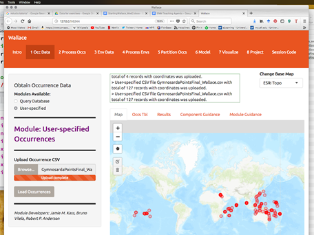

Note: You can interactively explore your points by clicking on them on the map (see below). 
You should see all the information associated with that record from the table you uploaded. 
This is helpful for verifying your occurrence points before progressing through the workflow.

Second Note: You can inspect the point data as a spreadsheet under the “Occs Tbl” tab next to the “Map” tab. 

=== Exercise 3 - Processing Occurrences 
At this point, you may notice that there are some points that do not look correct when they are mapped. 
This could be due to a clerical error, a human-mitigated introduction, or a natural vagrancy. 
Whatever the reason, these points can cause errors in your model and must be removed.

a)	Click on “2 Process Occs” in the menu bar at the top of the Wallace window.

b)	Select the “Select Occurrences on Map” radio button under “Modules Available”. 
 
c)	Click on the “Draw a polygon” button in the map window

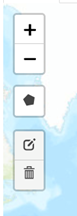

d)	Draw a polygon around the points you want to keep. 
In my case, I only want to keep the _Protea cynaroides_ occurrences in its native range in South Africa. 

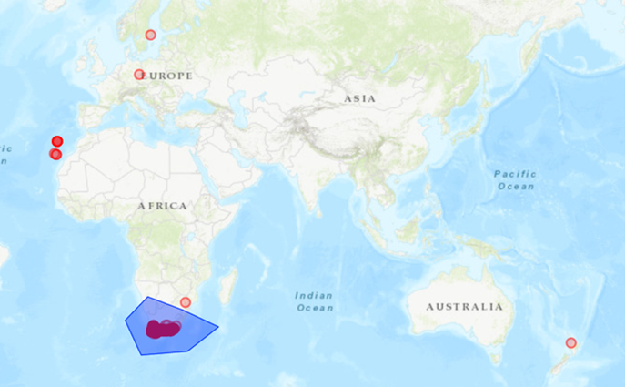

e)	Click the “Draw Polygon” button again and click “Finish”. 

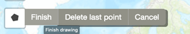

f)	Click the “Select Occurrences” button. If you don’t do this, all the points will be kept!

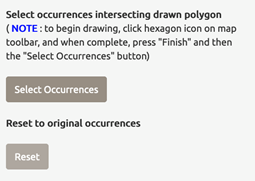

Note: For your own practical projects, you may also want to consider spatially thinning your data (this can remove some risk of sampling bias effecting your model results). 
We are not doing this step now because it takes a fair bit of time for some datasets.

=== Exercise 4 - Loading environmental data in Wallace.

a)	Click on “3 Env Data” in the browser window in which Wallace is running. 

b)	Select the “WorldClim Bioclims” radio button. 
Choose the 2.5 arcmin resolution (or whatever resolution you feel is most appropriate given your data) and check the “Specify variables to use in analysis?” box. 
Select the variables you think will be most informative for your model. 
Under “Module Guidance” there is an explanation of what the different variables are. 
Never use all 12 BioClim variables. 
It leads to overfit models with low predictive power. 

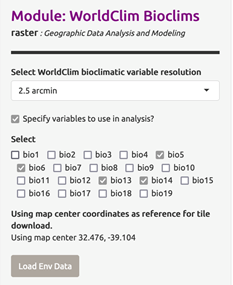

c)	Click the “Load Env Data” button. 
Your view should change to something similar to that shown below. 
The gray box will show metadata on the environmental data you have uploaded.

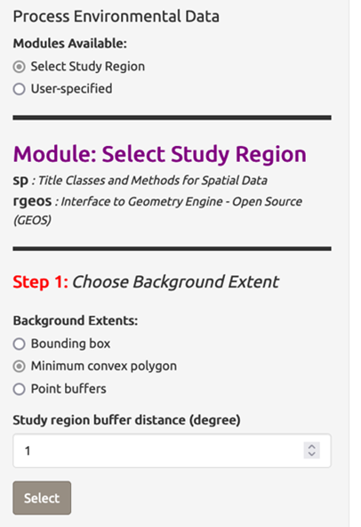
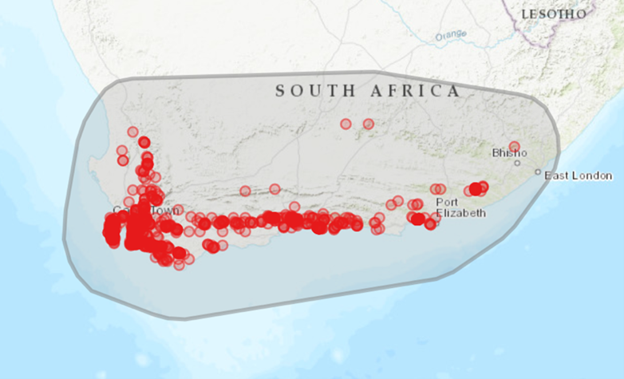

d)	Sample background points.

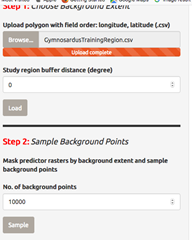

The number of background points shown (10,000) is fine.
This is the number of points that will be sampled randomly from the training region you have uploaded.  
Values of predictor variables for these background points can then be compared to those at the occurrence points to improve model fit.  
Click “Sample” and be patient. 
This takes a little time.

===  Exercise 6 - Partitioning Occurrence Data
Ideally, you will have two completely independent occurrence datasets to determine the strength of the model's predictive ability. 
Unfortunately, this rarely reality. 
When no independent datasets exist, one solution is to partition your data into subsets we assume are independent of each other, then sequentially build a model on all the subsets but one and evaluate this model on the left-out subset. 
This is known as k-fold cross-validation (where k is the total number of subsets). 
After this sequential model- building step is complete, Wallace summarizes (averages) the statistics over all the partitions and builds a consensus model using all the data.

a)	Click on “5 Partition Occs” in the browser window in which Wallace is running.

b)	Select the “Spatial Partition” radio button.

●	From the “Options Available” dropdown menu, select “Checkerboard 1 (k = 2)”. 

●	Click “Partition”. This may take a few minutes depending on the amount of occurrence data you have and the partition option selected.

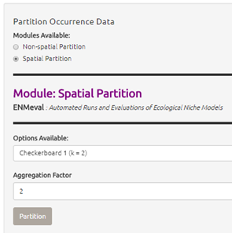

=== Exercise 7 - Calibrating Niche Models with Maxent

‘Wallace’ allows for very few opportunities to set the parameters of your models (as compared to using the Maxent GUI), but Wallace WILL run several model iterations with different parameter combinations and tell you which set fit the data best.

a)	Click on “6 Model” in the browser window in which Wallace is running.

b)	Select the “Maxent” radio button at the top left. Under “Select algorithm”, select the “maxnet” radio button. 
“Maxnet” and “maxent.jar” use the same underlying math, but “maxnet” does not use Java. 
This means it runs more readily on a wider range of computer operating systems than “maxent.jar”; Maxent was developed in the early 2000s using Java so that it had a graphical user interface. 
Now Java often causes more problems than it solves.

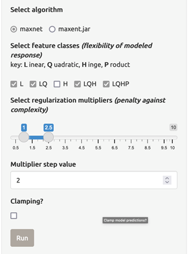

c)	Under “Feature classes” uncheck “Hinge”. 
Feature classes refer to the sorts of equations Maxent will use to try to model the data (linear equations, quadratic equations, and equations involving products). 
“Hinge” equations use two linear equations that “hinge” at a particular value of an explanatory variable, which isn’t a very natural response to an environmental variable.  

d)	Select regularization multipliers from 1 to 3. 
Set the “Multiplier step value” to 1. 
The regularization multiplier sets how closely our model fits the data that we have used.  
A smaller value than 1 will result in a more localized output distribution that is a closer fit to the presence records.  
Overfitting the model in this way may mean that it does’t generalize well to independent data.  
A larger multiplier will give a more spread out, less localized prediction.  
The multiplier step value sets the intervals at which regularization multiplier will be tested.  
So with multiplier values of 1-3 and a multiplier step value of 1, test models will be run for regularization multiplier values of 1, 2, and 3.

e)	Press ‘Run”. Be patient, this process can take a few minutes.

f)	When the process is complete, the ‘Results’ tab will open and display both the full model and partition evaluation statistics and the individual partition evaluation statistics. 
Remember, modeling algorithms are stochastic, so results displayed may be a little different each time you run the models.

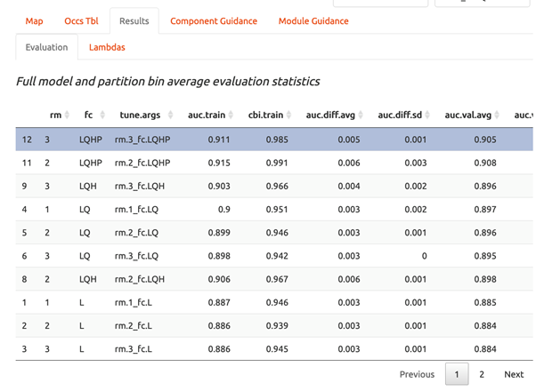

=== Exercise 8 - Model Evaluation and Selection

Wallace provides a fairly broad suite of evaluation metrics to use in determining which model to utilize. 
For our purposes, we will use AICc. 
Typically, the model with the lowest AICc score (or a delta AICc of 0) is considered to be the best model (balancing goodness-of-fit with simplicity). 
But, omission rate is also a common and effective method of evaluating binary predictions, so we will look at these as well.

a)	Look at the “Full model and partition bin average evaluation statistics” table in the Results section (the top table).

b)	Sort the AICc scores lowest to highest. Which model has the lowest AICc score? The name of the model tells you what the parameter settings are. RM = randomization multiplier, FC = feature class.

c)	Now look at the “Individual partition bin evaluation statistics” table (the bottom results table). 
You’ll see that data have been evaluated using binning based on two threshold levels: the 10 percentile training (or.10p) and the minimum presence training thresholds (or.MTP). 
Which model has the lowest omission rate? 

d)	Based on this information, choose the model you think is the best fit. 
This will likely be a compromise—one model that outperforms the others on all evaluation metrics is quite rare. 
Use your best judgement, and ask for help if you’re stuck.

=== Exercise 9 - Visualizing Model Results

Now that we’ve seen the numbers, let’s get an idea of what our niche models look like in terms of inferred response curves and geography.
NOTE: Remember to click on the “Component Guidance” tab if you need a refresher overview on niche/distributional models and the “Module Guidance” tab if you need additional information about the occurrence data partitioning methods.

a)	Click on “7 Visualize” in the browser window in which Wallace is running. 

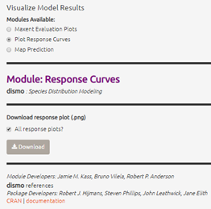

b)	Under “Visualize Model Results” select the “Plot Response Curves” radio button.

c)	In the “Results” window to the right, you’ll see a single plot for the first environmental variable. 
To view variable responses for the model you have decided is the best fit, select that model under “Current Model” at the far right side of the plot. 
To view a different response curve for another environmental variable, click on the “Current Env Variable” dropdown menu and select the variable you want to view. 
If you wish to view the response curves for all variables simultaneously, we will need to download the plots.

d)	Save the response plots. 
Under “Download response plot (.png)”, check the box next to “All response plots?” then Download. 
Open the plots to examine all response plots side-by-side. 
How do they look? 
Are they roughly bell-shaped, suggesting the model has completely characterized suitability of all the variables you used? 
Are the responses fairly smooth, or are they jagged, like the model is overfit?

=== Exercise 10 - Visualize model results in geographic space

a)	Under “Visualize Model Results” select the “Map Prediction” radio button.

b)	If you look to the right above you map, you’ll see 3 drop down menus. 
Click on the “Current Model” dropdown menu and select the model that performed best according to your model evaluation statistics.

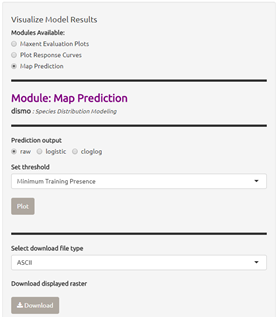

c)	Under “Prediction Output” select the “raw” radio button.

e)	From the “Set threshold” dropdown menu, choose the threshold (minimum training presence or 10 percentile training) that yielded the best omission rate accord to the model evaluation in Exercise 6. 

f)	Click on “Plot”. 
Your thresholded binary model results for the calibration/training region should appear in the display window with the extent of the training region denoted in red (an example is below).

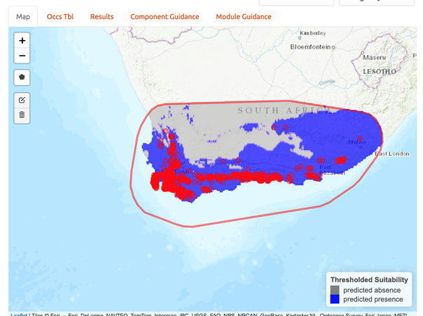

g)	Now, take a few minutes to explore the three alternate model projection options. 
That is, if your best evaluated model was LQHP_2 with a MTP threshold, then take a minute to visualize LQHP_2 with a 10 Percentile Training Threshold, LQHP_1 with a MTP, and LQHP_2 with a 10 Percentile Training Threshold. 
What similarities do you see across the visualizations? Are there major differences?

h)	Save your model prediction. 
First, be sure to return all settings to reflect your selected model and threshold. 
Then, select “ASCII” from the “Select download file type” dropdown menu, and press “Download”. 
Save the file to your working project folder.

=== Exercise 11 - Niche model projection

REMEMBER: if you want more information on the background of model projection, click on the “Component Guidance” tab; if you need additional information about the model projection process, click on the “Module Guidance” tab.

a)	Click on “8 Project” in the browser window in which Wallace is running.

b)	Under “Modules Available”, select the “Project to New Time” radio button. 
Select “2070” under “New Time Period”, and choose your favorite global circluation model and RCP scenario. 
The higher the number of the RCP scenario, the more CO2 in the simulated atmosphere.

c)	Click on “Draw a Polygon” on the left-hand of the map, then draw a polygon of the desired new extent of your projection. 
NOTES: Only project to the region you’re interested in. 
Global projections take a long time, and a lot of computing power. 
Also, a limitation of Wallace is that the new extent (the projection region) must include the full extent of the calibration region. 

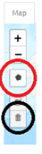

d)	From the “Set threshold” dropdown menu, select the model threshold you want. 

e)	Press “Project” under “Project model to current extent”. 
Be patient; it takes time to mask environmental grids to the new extent and project the model to this new area.

f)	Once the model projection is complete, delete the projection polygon you drew. 
To do this, click on the garbage can icon on the left side of the map (circled in black) and press “Clear all”. 
This should leave the polygon outline but remove the gray fill so you are able to view the model projection results.

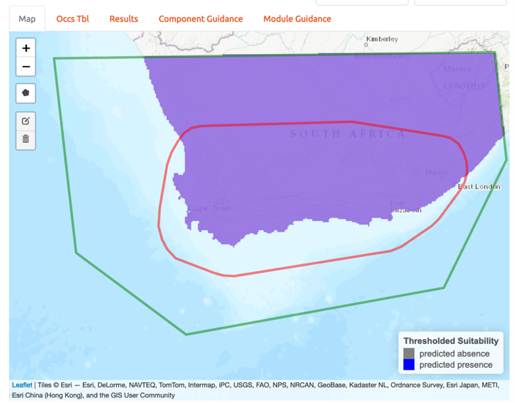

g)	Save your model projection. 
Under the “Select download file type” dropdown menu, select “ASCII”. 
Press “Download”. Save the file to your working project folder. 
NOTE: The file name automatically generated by Wallace is the exact same as the file name produced for the model training and projection files (the format includes the feature class selection of the model, the model number, and the selected threshold). 
As such, be sure to add “_proj” to the end of the file name. 
For example, the projection file name for the example provided here would be “LQHP_2_thresh_mtp_proj.asc”.

=== Exercise 12 - Calculating Environmental Similarity

MESS analyses allow us to characterize the degree to which the model projection region differs from the bioclimatic conditions of the model calibration region.

a)	Under “Project Model: Modules Available” select the “Calculate Environmental Similarity” radio button.

b)	Press the “Calculate MESS” button under “Calculate MESS for current extent”. 
Be patient; this process can take a fair bit of time depending on the geographic extent and spatial resolution of your data.

c)	Look at the resulting map. 
What stands out most? 
High positive values indicate increasing similarity with the conditions used to train the model, and low negative values indicate increasing difference relative to the model calibration bioclimatic conditions.

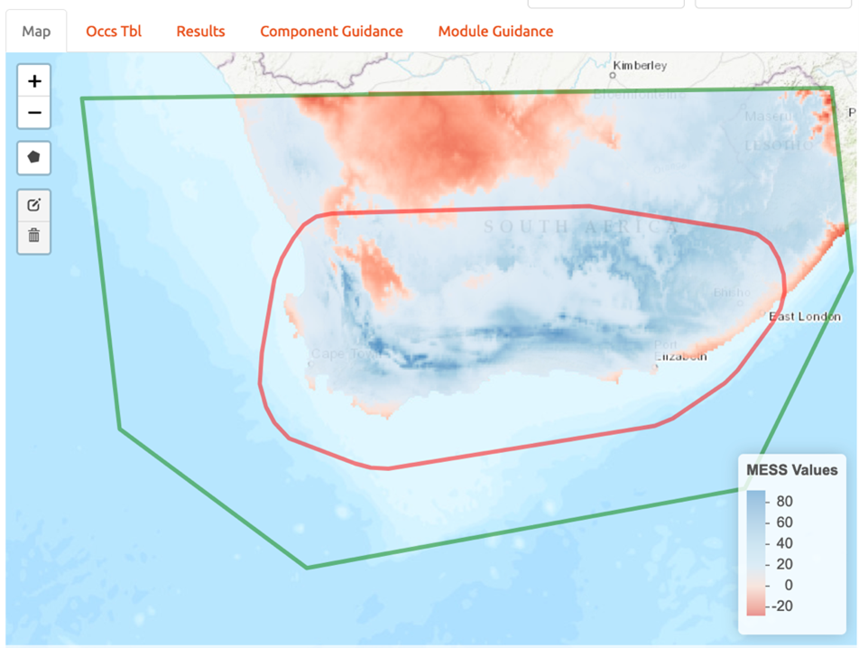

d)	Save MESS evaluation. 
Under the “Select download file type” dropdown menu, select “GeoTIFF”. 
Then press “Download”. Save the file to your working project folder. 
NOTE: The file name automatically generated by Wallace is the exact same as the file name produced for the model training and projection files (the format includes the feature class selection of the model, the model number, and the selected threshold). 
As such, be sure to add “_MESS” to the end of the file name. For example, the file name for the example provided here would be “LQHP_2_thresh_mtp_MESS.asc”.

=== Exercise 13 - Saving Your Session Code

It’s best practice to always maintain detailed records of the specific steps taken during research. 
Conveniently, Wallace provides us with the option to download a record of actions taking during the modeling session.

a)	Click on “Session Code” in the browser window in which Wallace is running.

b)	Under “Select download file type” dropdown menu, choose “Rmd”.

c)	Click on “Download Session Code”. Save the file to your working project folder. The default file name should work just fine.

d)	Congratulations! 
You have now successfully completed (maybe) your first niche model, and have the code to reproduce the whole analysis in R. 
If you open the RMD file in Rstudio, you will be able to see the code (and tweak and re-run the analysis, if you want!). 
You can also use this code to generate a pdf report detailing your analysis. 
