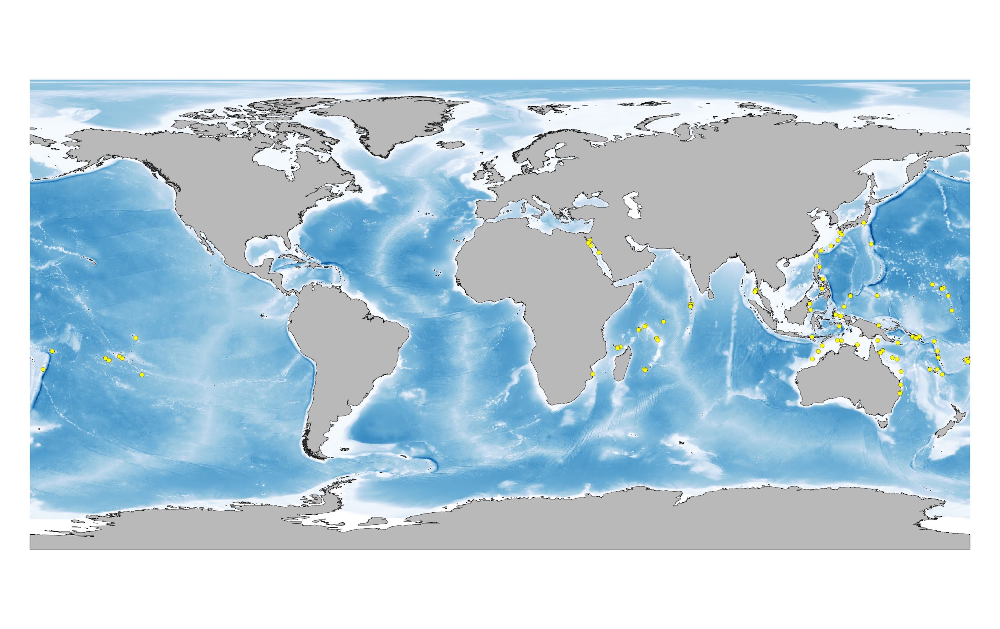

[multipage-level=2]
= Use Case 1 - Modelling Species Distributions Under climate Change
[NOTE.activity]
This is a practice use case for the ecological niche modeling module developed by Dr.Hannah Owens, University of Copenhagen. For this use case, you will use the modular, R-based platform Wallace link https://wallaceecomod.github.io/ for reproducible modeling of species niches and distributions. 
The platform is powered by a variety of R packages including dismo and enmeval allows and lowers the threshold for access to basic modeling functions through a user friendly graphical user interface (GUI).
It is a great platform for getting you started in in niche modeling and will allow to learn the basics of modeling, explore your data and generate a backcbone R script that will allow for the repeatability of your analyses.  
What it will not be able to do is generate final, publishable models but it should give you a good grasp of the principles of niche modeling. 

=== Exercise 1 - Starting Wallace

First thing’s first. We’ll start by launching Wallace and giving you a quick overview of the steps you will go through to generate a niche model. 
-	Launch RStudio.     
RStudio is a helpful platform for writing and executing R code. You can write and save scripts, execute commands, and keep track of datafiles. We don’t have time to give you an exhaustive overview of all the RStudio features, but if you are curious, check out the link at the end of this exercise. For our purposes, the important thing for you to know is that there are four panes in RStudio, as follows (note that depending on your operating system and the version of RStudio, it may not appear exactly identical):

-	 Launch Wallace

a)	If you have installed Wallace, proceed to step b. If you have not installed Wallace, type the following in the console window of RStudio and hit “Enter”: 

	install.packages(“wallace”);

b)	Type the following in console window of RStudio and hit “Enter”: 

	library(“wallace”);

c)	Type the following in console window of RStudio and hit “Enter”: 
	
run_wallace();

This should launch Wallace in an internet browser window.

Along the top of the browser is a menu bar with each of the steps that go into generating a niche model. You can also see this as a workflow in the left-hand panel. We will follow the general outline of this workflow, but with some slight modification. This will bel explained more as we work through generating our own  niche models today. 
=== Exercise 1 - Data Processing
You should download  datasets from www.gbif.org for _Gymnosarda unicolor_. Not all of the data within the download is fit-for-purpose, and in this exercise you should process your data download to only include those data points that you will be using to build your ecological niche model. You should use whichever processing tool you are most comfortable e.g. Excel, Open Refine, R etc. We have provided you with a step-by-step guide in Excel and an link:../data/DU_ENM_ExampleRScript.txt[R Script,opts=download]  if you would like to take a more programmatic approach to data processing. 

Q1.  What are the taxonkeys for each of the species and what is the taxonomic status of each species?

Q2.  In what format did you download the data and how what are the unique properties of this type of download?

Q3.  What is the DOI for your download and how would you correctly cite this in a scientific publication?

Q4. What are the following key data quality processing steps did you use for cleaning both datasets?  For each requirement, what is your justification?

* Default geospatial issues
* Absence records
* Fossils and living specimens
* Establishment Means
* Old records
* Uncertain location 
* Bad default values for coordinate uncertainty
* Points along the Equator or prime meridian
* Country centroids
* Duplicate removal
* Outliers
* Metagenomics
* Outside Native ranges
* Gridded datasets
* Automated identifications

Q5. What additional data processing steps might you want to validate taxonomic identification of species?

=== Exercise 2 - Starting Wallace and Loading Occurrences
[NOTE.activity]
First thing’s first. We’ll start by launching Wallace and giving you a quick overview of the steps you will go through to generate a niche model. You have been provided with a link:../data/DU_ENM_Exercise1_Starting_Wallace.docx[step-by-step guide,opts=download] to this exercise.

For this use case we will be using the modular, R-based platform Wallace link https://wallaceecomod.github.io/ for reproducible modeling of species niches and distributions. 
The platform is powered by a variety of R packages including dismo and enmeval allows and lowers the threshold for access to basic modeling functions through a user friendly graphical user interface (GUI).
It is a great platform for getting you started in in niche modeling and will allow to learn the basics of modeling, explore your data and generate a backcbone R script that will allow for the repeatability of your analyses.  
What it will not be able to do is generate final, publishable models but it shoudl give you a good grasp of the principles of niche modeling. 

Wallace allows you to visualize your data and remove indivual data records that may be outliers or imprecise within the Process Occurrence Data module. 
Visualize your processed data and remove any additioanl data points that you may have missed in the initial data processing step. 

Q1. What is the overall goal of your ecological niche model? That is, what question or hypothesis are you exploring?

Q2. What type of niche are we modeling? What limits our ability to model the kind of niche we hope to model?

=== Exercise 3 - Determining a training region
[NOTE.activity]
In this activity you will have to to define a geographic region - a training region - that reflects the natural disctribution of the species and from which your model will sample environmental variables. 

Q1. On the map below, draw what you think would be a good training region for the model. 

Q2. Why did you choose this area? Is it based on where the species is known to occur, as well as areas it could access? Are there features of the species’ natural history that help inform your choice?

===  Exercise 4 - Loading environmental data and partitioning occurrence data
[NOTE.activity]
[width=100%]
[cols="1,1"]
|===
|Skills Acquired |Data Required 

a|* Process environmental data layers to within your training region
* Sample background points within your training region
* Partition a dataset for an ecological niche model
|A set of biologically-relevant environmental covariates that are minimally correlated
|=== 

Now that you know how to determine a training region, you will load your environmental data into Wallace and trim it to a training region we have made for you. Training region shapefiles are best made by creating a polygon shapefile in QGIS (or the GIS program of your choice). This is beyond the scope of this workshop, but here’s a tutorial: https://github.com/mtop/speciesgeocoder/wiki/Tutorial-for-creating-polygons-in-QGIS. We have provided you with a series of environmental variables from the MARSPEC dataset -  a set of high resolution climatic and geophysical GIS data layers for the world ocean from 1955 - 2010.  The variables have provided have been selected because they are biologically relevant and covary minimally. There is a very nice resource for distribution modeling at http://rspatial.org/sdm/; for more information on determining covariate correlations, see Chapter 4 on that website.

You have been provided with a link:../data/DU_ENM_Exercise4_Env_Data_Calibr.docx[step-by-step guide,opts=download] for this exercise.

=== Exercise 5 - Model Evaluation
[width=100%]
[cols="1,1"]
|===
|Skills Acquired |Data Required 

|Build an ecological niche model using a presence-background algorithm i.e. Maxent, Produce a set of model evaluation statistics for model selection
|None
|=== 

You have been provided with a link:../data/DU_ENM_Exercise7_Calibration.docx[step-by-step guide,opts=download] for this exercise.

As we discussed in lecture, the parameters you use in calibrating you niche model can be critical in determining the reliability of resulting model predictions.  In Wallace we do this by selecting  feature classes, which essentially set the rules for model fitting. These feature classes refer to the sorts of equations Maxent will use to try to model the data (linear equations, quadratic equations, and equations involving products). “Hinge” equations use two linear equations that “hinge” at a particular value of an explanatory variable. “Threshold” determines that above or below a particular value of a particular environmental variable, habitat is immediately no longer suitable.  Ideally, we would select a combination of linear, quadratic, and product, which tends to fit models in a more biologically realistic manner and with less overfitting than if we also include hinge and threshold methods. 

We can also select regularization multiplier and multiplier step values.  The regularization multiplier sets how closely our model fits the data that we have used.  A smaller value than the default of 1 will result in a more localized output distribution that is a closer fit to the presence records.  Overfitting the model in this way may mean that it does’t generalize well to independent data.  A larger multiplier will give a more spread out, less localized prediction.  The multiplier step value sets the intervals at which regularization multiplier will be tested.  So with multiplier values of 1-2 and a multiplier step value of 0.5, test models will be run for regularization multiplier values of 1, 1.5, and 2.

Q1. Record the AICc score for each model.

Q2. Which model performed better according to AICc

Q3. Fill in the following table with the model evaluation statistics for your model 

Q4. Based on the overall omission rate for all the bins, which model performed better? Does this match the conclusion reached using AICc?

Q5. Based on AICc and omission rate, which model do you think will be the best to continue working with?

===== Exercise 6 - Visualizing, Thresholding, and Projecting Niche Models
[width=100%]
[cols="1,1"]
|===
|Skills Acquired |Data Required 

|Evaluate the fit of a model using variable response curves, Thresholding a continuous model output into a binary model output, Project models into a new time, Identify areas of model extrapolation in model projections 
|Future predictions of climate variables
|=== 

In this exercise, you will process results from Exercise 6 to produce maps of _Gymnosarda unicolor_ suitable habitat, as well as several plots to diagnose model performance. You will also project your Rainbow tuna model into different bioclimatic conditions. You have been provided with a link:../data/DU_ENM_Exercise6_Visualize_Threshold_Project.docx[step-by-step guide,opts=download] for this exercise.

Q1. What similarities do you see across the four visualizations? What  are the major differences?

Q2. Look closely at your projected model. Based on what you know about our study species, _Gymnosarda unicolor_, do your model results make sense? Are there any areas of predicted absence or presence that are questionable? What areas? Why do you question the model prediction in these areas? 

