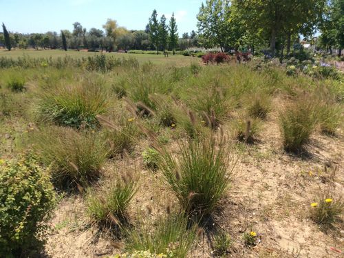

[multipage-level=2]
= Use Case 3 - Modeling invasive species distributions

Use Case 3 is a practice use case for the data proecessing and ecological niche modelling modules. 
It is recommended that you download the exercise sheet (MS Word 345 KB) so that you can make notes as you work through the exercises. 
A suggested solution will be provided in the solution appendix. 
Use Case I is not graded.

=== Scenario

Pennisetum setaceum by Jael Palhas via vBioDiversity4All , licensed under CC BY-NC 4.0

Description

Mexico is a mega-diverse country with high numbers of species and high levels of endemism across all taxonomic groups. One of the threats in the region is from invasive species and in particular the introduction of the African grass species, Pennisetum setaceum (Forssk.) Chiov.  It has become invasive in parts of its introduced range in the United States of America. The species is native to Tanzania, Kenya, Eritrea, Ethiopia and Yemen.  The species is popular as a horticultural species in Mexico, and local populations often encourage it since it can be used as fodder, to make fences, as thatch, and is made into soup or stew for human consumption. In Mexico, it has naturalized and is rapidly expanding its range.  The species spreads in the tropical dry forest understory and aggregates in clearings often becoming the dominant species replacing native species.  
A key part of developing adequate management plans for those areas is understanding the relative impact of threats to those areas, and the government is particularly keen to understand the relative impact of invasive species.   

Data Collection
You will use global datasets from www.gbif.org for Pennisetum setaceum. 

=== Invasives Exercise Sheet

Download the exercise sheet. (MS Word, 342 KB)

=== Exercise 1
Exercise 1 - Data Processing
You should download  datasets from www.gbif.org for Pennisetum setaceum. There is a step-by-step guide or R markdown document provided to you to guide you through this exercise

Q1.  What are the taxonkeys for each of the species and what is the taxonomic status of each species?

Q2.  In what format did you download the data and how what are the unique properties of this type of download?

Q3.  What are the DOIs of your downloads?

Q4. What are the following key data quality processing steps did you use for cleaning both datasets?  For each requirement, what is your justification?
-	Default geospatial issues
-	Absence records
-	Fossils and living specimens
-	Establishment Means
-	Old records
-	Uncertain location 
-	Bad default values for coordinate uncertainty
-	Points along the Equator or prime meridian
-	Country centroids
-	Duplicate removal
-	Outliers
-	Metagenomics
-	Outside Native ranges
-	Gridded datasets
-	Automated identifications
Q5. What additional data processing steps might you want to validate taxonomic identification of species?
-	

=== Exercise 2
First thing’s first. Launch Wallace.   You will be running an ecological niche model on the Pennisetum setaceum data.
Please use the step-by-step guide to guide you through this exercise.

Exercise 4:

Q1. What is the overall goal of your ecological niche model? That is, what question or hypothesis are you exploring?

Q2. What type of niche are we modeling? What limits our ability to model the kind of niche we hope to model?

=== Exercise 3 - Training Regions and Environmental Data
In this exercise, you should determine what your training region for your model will be and select this within Wallace. 

Q1. On the map below, draw what you think would be a good training region for the model for Pennisetum setaceum. 
 
Q2. Why did you choose the area you chose? Is it based on where the species is known to occur, as well as areas it could access? Are their features of the species’ natural history that help inform your choice?

=== Exercise 4 - Partitioning Occurrence Data and Calibrating Niche Models
In this exercise, partition your occurrence data for Pennisetum setaceum and run a Maxent model in Wallace. 
Based on the model evaluation statistics, you should select the model to continue working with.  
Please use the step-by-step guide to guide you through this exercise.

Exercise 4 - Partitioning Occurrence Data and Calibrating Niche Models
Q1. Record the AICc score for each model.
i)	LQHP_1: 
ii)	LQHP_2: 

Q2. Which model performed better according to AICc

Q3. Fill in the following table with the model evaluation statistics for your model 

Model	OR10_bin.1	OR10_bin.2	OR10_bin.3	OR10_bin.4	ORmin_bin.1	ORmin_bin.2	ORmin_bin.3	ORmin_bin.4
LQHP_1								
LQHP_2								

Q4. Based on the overall omission rate for all the bins, which model performed better? Does this match the conclusion reached using AICc?

Q5. Based on AICc and omission rate, which model do you think will be the best to continue working with?

=== Exercise 5 - Visualizing, Thresholding, and Projecting Niche Models
In this exercise, you will process results from Exercise 6 to produce maps of Pennisetum setaceum suitable habitat, as well as several plots to diagnose model performance. You will also project your Pennisetum setaceum model into different geographic regions with a particular focus on Mexico and the Americas. Please use the step-by-step guide to guide you through this exercise.

Exercise 5 - Visualizing, Thresholding and Projecting Niche Models

Q1. What similarities do you see across the four visualizations? What are the major differences?

Q2. Look closely at your projected model. Based on what you know about our study species, Pennisetum setaceum, do your model results make sense? Are there any areas of predicted absence or presence that are questionable? What areas? Why do you question the model prediction in these areas?
