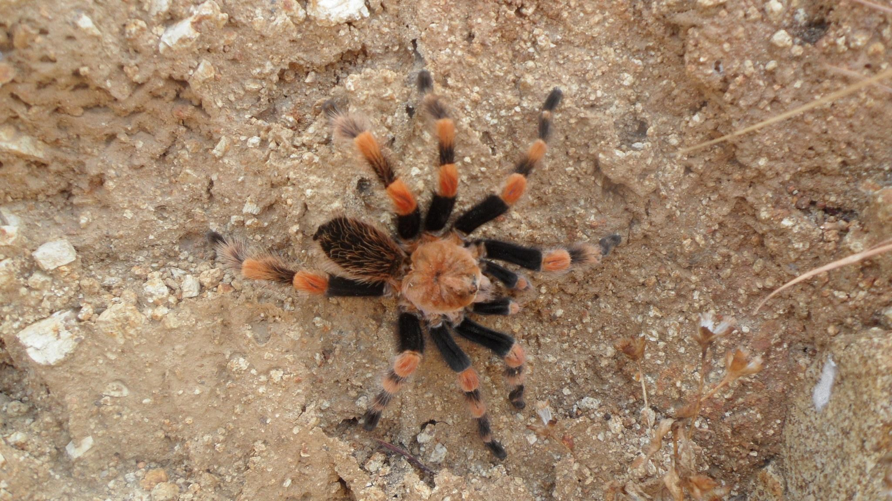

[multipage-level=2] 
= Use Case - Red List Assessment
[NOTE.activity]
This Use Case is a practice use case for the data processing and assessing conservation status using the IUCN Categories and Criteria module. 
Please note that this use case is fictitious and built for instructional purposes only.  Any reference to countries and structures/organisations, real or otherwise, within those countries are used merely to facilitate the use of the data and may not reflect the reality within those countries.  

== Scenario

  Brachypelma smithi (F.O.Pickard-Cambridge, 1897) observed in Mexico by adrianita (licensed under http://creativecommons.org/licenses/by-nc/4.0/) - https://www.gbif.org/occurrence/1453068554  

Mexico is a mega-diverse country with high numbers of species and high levels of endemism across all taxonomic groups.
The government is committed to assessing the conservation status of all its species and has agreed to develop a national red list applying IUCN Categories and Criteria to all vertebrate and invertebrate taxonomic groups by the year 2030. 
As part of this process, they have started the assessment of arachnid groups and are now assessing the conservation status of all species within the family Theraphosidae – the tarantulas.  

National and international arachnid specialists have come together at a Mexican arachnid red list workshop and they will now be assessing the conservation status of the tarantula species Brachypelma smithi (F.O.Pickard-Cambridge, 1897) and Aphonopelma anax (Chamberlin, 1940).  
Assessors want to use GBIF-mediated data to assess the species using Criterion B and provide maps that comply to IUCN documentation requirements. 

Description

_Brachypelma smithi_ (F.O.Pickard-Cambridge, 1897) is a large spider species in the family Theraphosidae.  
It has a very restricted range within the state of Guerrero, requiring clearings in tropical dry forests on sandy soil where it can build its tunnel/den.  
As with other tarantula species, males and females have different lifespans with averages of 6 and 25 years respectively.  
Both males and females reach sexual maturity on average after 4 years.  
The species plays a role in local indigenous culture where it is considered a vessel for the souls of community members and is thus afforded protection where the species is found near local, indigenous communities.  
The species is threatened by the collection of individuals for the pet trade and is listed under CITES Appendix II; it is highly prized by collectors due to its rarity.  

_Aphonopelma anax_ (Chamberlin, 1940) ) is a large spider species in the family Theraphosidae. 
It is found in Southern Texas, USA and North Mexico. 
They are found in semiarid climates in grasslands and shrub forests as well as within cities. 
They live in burrows that can be created by themselves or modifying suitable habitats such as dead trees, empty rodent burrows, stacks of wood or natural crevices. 
They have slow growth rates and live for several years before maturing – females can live up to 40 years while males rarely live over 2 years once they have matured. 
The species is common across its range and although there has been increasing urban and agricultural development across its range in both the USA and Mexico, the extent of this development is limited to only a small portion of the species entire range.

=== Exercise - Applying IUCN Red List Criterion B

In this exercise, you will calculate the Extent of Occurrence and Area of Occupancy for Brachypelma smithi and Aphonopelma anax using GeoCat - www.geocat.kew.org  and then do Red List assessments for the species.  For the purposes of this exercise, we will apply the global IUCN Categories and Crtieria to both species across their range in Mexico. In reality, the regional Categories and Criteria should be applied as these are national assessments.  

[cols="1,1,1"]
|===
3+|_Brachypelma smithi_ (F.O.Pickard-Cambridge, 1897)

|Extent of occurrence
2+|

|Area of Occupancy
2+|

2+|
|Justification (please state whether this is observed, estimated, projected, inferred or suspected)

|Severe Fragmentation 
|Yes or No
|

|Number of Locations 
|
|

|Continuing Decline
|Yes or No
|

|Extreme Fluctuations
|Yes or No
|

|Final Assessment
2+|
|===
[cols="1,1,1"]

|===
3+|

_Aphonopelma anax_ (Chamberlin, 1940)

|Extent of occurrence
2+|

|Area of Occupancy
2+|

2+|
|Justification (please state whether this is observed, estimated, projected, inferred or suspected)

|Severe Fragmentation 
|Yes or No
|

|Number of Locations 
|
|

|Continuing Decline
|Yes or No
|

|Extreme Fluctuations
|Yes or No
|

|Final Assessment
2+|
|===

